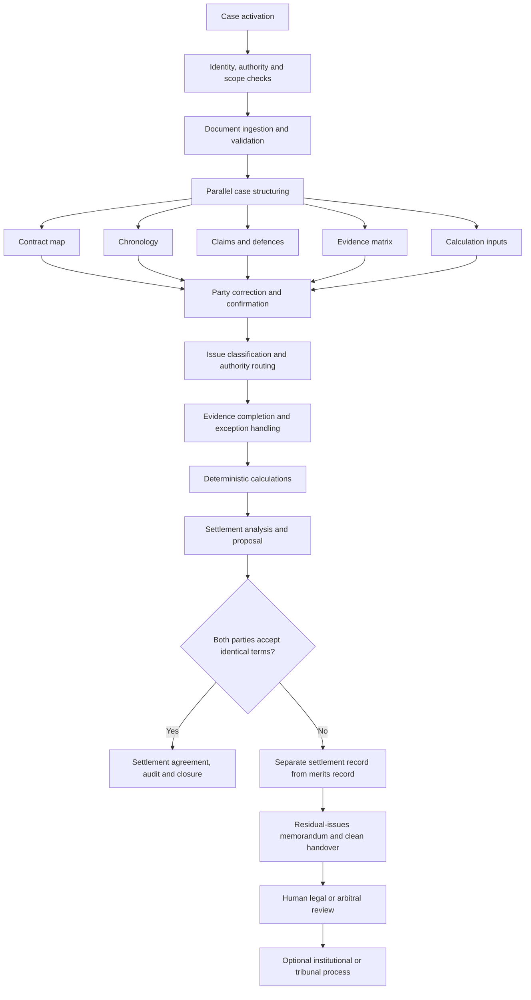

# Service Blueprint and Legal Process Specification

## AI-Native Settlement and Arbitration-Readiness Service

**Document type:** Operating model and end-to-end legal workflow  
**Version:** 1.0  
**Date:** 11 July 2026  
**Owner:** Enrique Georg Zbinden  
**Status:** Implementation specification for the hackathon MVP, with target-state extensions  
**Primary jurisdiction for the MVP:** Switzerland  
**Comparative reference jurisdictions:** Germany and Austria  

---

## 1. Document Purpose

This document defines how the legal service operates from the first submission of a commercial dispute until either:

1. the parties conclude a binding settlement through separate affirmative acceptance; or
2. the unresolved matter is transferred as a clean, structured, source-linked record for human legal or arbitral review.

It converts the Project Charter into an operational process. It specifies:

- actors;
- inputs;
- process stages;
- decisions;
- authority boundaries;
- outputs;
- approval gates;
- escalation rules;
- exceptional cases;
- human handovers;
- record separation;
- audit requirements;
- service-level controls.

The document covers two operating models:

1. the conventional legal process before AI agents; and
2. the target AI-native process in which agents perform administrative, mechanical, and advisory work at scale while humans retain consent, legal judgment, and adjudicative authority.

The target process uses human control selectively. Human attention is concentrated at points where authority, rights, material uncertainty, or irreversible consequences arise. Humans supervise the system, resolve exceptions, and exercise reserved powers. They are not inserted as mandatory reviewers of every routine step.

---

## 2. Status and Relationship to Other Documents

This specification sits between the project charter and the technical architecture.

| Document | Primary question |
|---|---|
| **Project Charter** | What problem is the service solving, for whom, and within what scope? |
| **Service Blueprint and Legal Process Specification** | How does the legal service operate from beginning to end? |
| **Legal Authority, Governance and Procedural Safeguards Specification** | Who or what may make, approve, contest, or execute each decision? |
| **Product Requirements Document** | What must the product enable users to do? |
| **Human–AI Interaction and Information Architecture Specification** | How must each actor understand, inspect, correct, challenge, and control the process? |
| **System Requirements and Technical Architecture Specification** | How will the approved process be implemented securely and reliably? |

The process defined here is the operational source of truth. The technical system must implement the process and its authority boundaries. Engineering choices do not independently create legal authority.

---

## 3. Scope

### 3.1 Hackathon MVP scope

The MVP begins after a commercial dispute has arisen. It processes one seeded Swiss B2B software dispute and supports:

- dispute intake;
- document ingestion and validation;
- contract and obligation extraction;
- source-linked chronology construction;
- fact and evidence classification;
- party correction and confirmation;
- authority routing;
- deterministic contractual calculation;
- non-binding settlement modelling;
- bilateral acceptance or rejection;
- separation of settlement material from the merits record;
- preparation of a residual-issues memorandum;
- human-ready legal or arbitral handover;
- complete case-ledger recording.

The MVP ends at settlement or structured handover. It does not appoint an arbitrator, conduct an arbitration, determine contested liability, assess credibility, or issue an award.

### 3.2 Target-state extension

The broader operating model may later support:

- institutional or ad hoc arbitration intake;
- arbitrator conflict and qualification workflows;
- tribunal constitution support;
- procedural conferences and timetables;
- submissions and document-production management;
- evidence matrices and hearing preparation;
- AI-supported issue analysis and counterargument generation;
- tribunal-controlled decision composition;
- award drafting support;
- correction, interpretation, challenge, and enforcement-readiness workflows.

In the target state, the arbitral institution administers the proceeding. The appointed arbitrator or arbitral tribunal decides the merits. The AI system structures, checks, retrieves, calculates, compares, and drafts within defined authority limits.

### 3.3 Matters outside this specification

The following require separate specifications or jurisdiction-specific legal review:

- production identity and anti-fraud architecture;
- professional-regulation analysis for legal-service delivery;
- data-protection impact assessment;
- privilege rules across jurisdictions;
- cybersecurity controls;
- enforceability of electronic signatures and settlement formalities;
- production filing with courts, authorities, or arbitral institutions;
- payment execution;
- complete limitation-period automation;
- consumer, employment, family, criminal, or public-law disputes.

---

## 4. Service Definition

### 4.1 Service statement

> The service converts a commercial contract dispute into a structured, contestable, source-linked, and auditable legal process that leads either to bilateral settlement or to a clean human-ready merits record.

### 4.2 Primary service outcomes

The service produces one of two principal outcomes.

#### Outcome A: Bilateral settlement

Both parties separately accept the same settlement terms. The system generates a settlement agreement, records acceptance, preserves the agreed audit trail, and closes or transitions the matter according to the agreed terms.

#### Outcome B: Human-ready escalation

At least one material issue remains unresolved. The system excludes protected settlement positions from the merits record and produces a neutral handover package for counsel, an arbitrator, an arbitral tribunal, or an administering institution.

### 4.3 Core operating thesis

The service treats legal work as a governed production system rather than a sequence of unstructured emails and chatbot exchanges.

The central operational unit is the **case state**, consisting of:

- parties;
- authority and representation;
- contract documents;
- obligations;
- claims and defences;
- factual propositions;
- evidentiary sources;
- status of each proposition;
- legal issues;
- calculations;
- settlement positions;
- approvals;
- unresolved questions;
- procedural events;
- versions and audit records.

---

## 5. Fundamental Process Principles

### 5.1 Human-owned adjudication

The system may support adjudicative work, but final determinations on contested liability, credibility, open-textured legal standards, disputed damages, remedies, and arbitral awards remain human-owned.

### 5.2 Explicit party consent

A settlement becomes binding only after both parties separately provide affirmative acceptance to the same complete terms through a legally adequate method.

### 5.3 Contestability

Every material AI-generated extraction, classification, inference, and recommendation must be open to correction or challenge by an authorised user.

### 5.4 Procedural equality

Equivalent procedural opportunities, information structures, deadlines, and correction mechanisms apply to both parties, subject to legitimate procedural distinctions.

### 5.5 Evidence before recommendation

The system presents sources, facts, and evidentiary gaps before presenting a preferred settlement proposal or legal position.

### 5.6 Deterministic calculation

Numerical calculations use reproducible code or explicit formulas applied to confirmed inputs. Language models may extract candidate inputs and explain results, while the computation itself remains deterministic.

### 5.7 Visible legal effect

Every output carries a status such as:

- extracted;
- unverified;
- party-asserted;
- disputed;
- inferred;
- mechanically calculated;
- advisory;
- accepted;
- rejected;
- human-reviewed;
- reserved for determination;
- final.

### 5.8 Source traceability

Each material proposition links to its source document, relevant passage, submitting actor, extraction or reasoning step, version, and review status.

### 5.9 Settlement-record separation

Confidential settlement positions and concessions remain logically separated from the clean merits record, subject to the parties’ agreement and applicable law or rules.

### 5.10 Escalation by authority and risk

Escalation follows the legal nature of the issue, the existence of disputed inputs, procedural consequences, and defined risk triggers. A model confidence score alone does not determine legal authority.

### 5.11 Efficiency with protective friction

Routine actions should be fast. Material corrections, waivers, settlement acceptance, evidence exclusion, and adjudicative decisions should include deliberate confirmation and inspectable reasons.

---

## 6. Conventional Process Before AI Agents

### 6.1 Baseline workflow

A conventional commercial-dispute process commonly develops as follows:

```text
Client emails documents
→ lawyer or claims professional opens and renames files
→ junior team manually reviews the contract and correspondence
→ chronology is built in a spreadsheet
→ claims, defences, and evidence are reconstructed in memoranda
→ missing documents are requested through email
→ damages are calculated separately
→ settlement positions are exchanged
→ settlement fails or succeeds
→ if settlement fails, counsel rebuilds the record for arbitration
→ institution administers the case
→ arbitrator or tribunal reconstructs the issues and evidence again
```

### 6.2 Baseline service blueprint

| Stage | Primary human work | Typical output | Structural bottleneck |
|---|---|---|---|
| Intake | Read emails, identify matter, request missing files | Matter opening note | Intake quality depends on individual reviewer |
| Document organisation | Download, rename, deduplicate, classify | Folder structure | High-volume repetitive work |
| Contract analysis | Read clauses and schedules | Contract summary | Sequential expert attention |
| Fact reconstruction | Read correspondence and logs | Chronology | Manual cross-document comparison |
| Issue spotting | Identify claims, defences, and legal questions | Issue list | Expertise concentrated in senior lawyers |
| Evidence assessment | Link facts to documents | Evidence table | Provenance often fragmented |
| Calculation | Re-enter inputs into spreadsheets | Damages model | Copying errors and version drift |
| Settlement | Draft letters, compare offers, revise terms | Proposal or agreement | Negotiation record may mix with merits analysis |
| Escalation | Repackage the file for counsel or tribunal | Handover memorandum | Major duplication of earlier work |
| Arbitration | Reconstruct procedure and record | Procedural orders and award | Tribunal begins with an unstructured file |

### 6.3 Why the conventional process scales poorly

The baseline process has five recurring constraints.

#### Sequential production

A person often completes one task before the next task can begin. Several activities that could run in parallel remain tied to one file owner.

#### Repeated reconstruction

The same contract, facts, and evidence are summarised for intake, settlement, external counsel, the arbitral institution, and the tribunal.

#### Review of entire files

Senior reviewers often receive broad, unstructured bundles rather than focused exception packets. Their attention is spent finding the question before answering it.

#### Weak state control

Facts, calculations, offers, and legal positions are stored across emails, spreadsheets, and document versions. The current authoritative state can become unclear.

#### Time-based economics

Efficiency reduces billable time under a conventional hourly model. Scaling therefore depends heavily on additional professional headcount.

---

## 7. AI-Native Target Operating Model

### 7.1 Target workflow

```text
Case activation
→ guided intake and authority checks
→ parallel document validation and extraction
→ contract map, chronology, claims map, and evidence matrix
→ party corrections and confirmations
→ authority classification and issue routing
→ evidence-gap requests
→ deterministic calculations
→ symmetrical settlement modelling
→ bilateral acceptance gate
→ settlement agreement and closure
   OR
→ clean separation of settlement material
→ residual-issues memorandum
→ focused human legal or arbitral review
→ optional institutional or tribunal process
```

### 7.2 Parallel service production

Once documents pass validation, several agent-supported workstreams may operate concurrently:

- contract extraction;
- chronology construction;
- claim and defence identification;
- evidence linking;
- duplicate and contradiction detection;
- calculation-input extraction;
- missing-information identification;
- settlement-range modelling;
- audit-ledger recording.

The system then reconciles these workstreams into one case state. Conflicts between outputs become explicit exceptions rather than invisible drafting inconsistencies.

### 7.3 Before-and-after comparison

| Dimension | Conventional process | AI-native process |
|---|---|---|
| Matter intake | Free-form email and manual triage | Guided intake with automated completeness checks |
| File organisation | Manual folders and naming | Ingestion pipeline with validation, hashing, classification, and versioning |
| Contract analysis | Repeated human reading | Source-linked contract map with focused exception review |
| Fact chronology | Manual spreadsheet | Automatically proposed chronology, party-correctable |
| Evidence mapping | Created late and inconsistently | Built as a core case object from the beginning |
| Calculations | Separate spreadsheet workflow | Deterministic calculation linked to confirmed contractual inputs |
| Senior review | Broad file review | Structured review packet containing only the decision, sources, alternatives, and risk |
| Settlement | Drafted from narrative summaries | Generated from the live merits model, with bilateral acceptance gates |
| Failed settlement | File reconstructed for escalation | Clean merits record generated from existing case state |
| Human role | Repetitive production and broad checking | Reserved authority, exception resolution, supervision, and adjudication |
| Scalability | Additional volume requires proportional headcount | Routine throughput scales through automation, with human capacity focused on exception rates |

---

## 8. Actors and Responsibilities

### 8.1 Client or initiating party

The initiating party:

- opens the matter;
- identifies authorised representatives;
- submits documents and statements;
- corrects its factual record;
- confirms or disputes extracted information;
- provides settlement instructions;
- accepts or rejects proposals;
- approves consequential actions.

### 8.2 Opposing party

The opposing party:

- receives procedurally adequate notice;
- verifies identity and authority;
- accesses an equivalent case interface;
- submits its position and evidence;
- corrects or disputes propositions;
- responds to evidence requests;
- accepts or rejects settlement proposals;
- preserves its right to human review or arbitration.

### 8.3 AI system

The AI system performs bounded service functions:

- extraction;
- classification;
- summarisation;
- source linking;
- chronology generation;
- contradiction detection;
- issue structuring;
- evidence-gap identification;
- deterministic-tool invocation;
- proposal generation;
- balanced argument preparation;
- handover drafting;
- audit recording.

The system does not possess independent legal authority.

### 8.4 Lawyer or qualified human reviewer

The reviewer handles:

- contested legal interpretation;
- jurisdiction and applicable-law questions;
- limitation and prescription issues;
- privilege and confidentiality questions;
- evidentiary disputes;
- material model conflicts;
- exceptional settlement structures;
- final submissions;
- professional-responsibility decisions.

### 8.5 Arbitrator or arbitral tribunal

The arbitrator or tribunal:

- receives authority through valid appointment;
- remains independent and impartial;
- controls the arbitral procedure within applicable law and agreed rules;
- ensures equality and the right to be heard;
- decides jurisdiction where applicable;
- rules on evidence and procedure;
- evaluates disputed facts and legal arguments;
- determines remedies;
- owns and signs any award.

### 8.6 Case administrator

The administrator manages operational functions such as:

- case activation;
- service status;
- deadlines;
- access rights;
- fee status;
- communication routing;
- technical exceptions;
- record completeness;
- closure and retention.

The administrator does not decide the merits.

### 8.7 Arbitral institution

Where institutional arbitration is used, the institution may:

- receive the request for arbitration;
- administer fees and deposits;
- transmit communications;
- support constitution of the tribunal;
- appoint or confirm arbitrators under its rules;
- decide institutional challenges where authorised;
- maintain procedural administration;
- review an award’s form where its rules provide.

The institution normally does not decide the merits. The appointed arbitrator or tribunal does.

### 8.8 External institutions

External actors may include:

- state courts supporting appointment, interim measures, evidence, challenge, or enforcement;
- e-signature providers;
- payment providers;
- forensic or technical experts;
- translators;
- document custodians;
- arbitral institutions;
- enforcement authorities.

Each interaction must be separately authorised and logged.

---

## 9. Authority Model

### 9.1 Authority classes

| Authority class | System function | Legal effect | Default human control |
|---|---|---|---|
| **Administrative** | Organise, validate, extract, classify, route, and record | Procedural or operational | Human-on-the-loop, exception review |
| **Mechanical** | Apply a fixed rule or formula to confirmed inputs | Provisional or contractually defined result | Input confirmation and exception review |
| **Advisory** | Analyse, compare, model, draft, and recommend | Non-binding until accepted or adopted | Human-at-the-gate for consequential use |
| **Adjudicative** | Structure the record and prepare competing reasoning | No independent binding effect | Human-in-command and final determination |

### 9.2 Activity-level authority matrix

| Activity | AI permitted | Human or party gate | Final authority |
|---|---|---|---|
| Validate file type and readability | Yes | Exception only | Administrator for unresolved failure |
| Detect duplicates and versions | Yes | Exception only | Administrator |
| Extract names, dates, clauses, and amounts | Yes | Material fields subject to correction | Party or reviewer confirms disputed fields |
| Build chronology | Yes | Parties may correct and contest | Status remains provisional until confirmed or adjudicated |
| Classify a proposition as agreed or disputed | Yes, based on party responses | Party confirmation | Parties or later tribunal |
| Link evidence to propositions | Yes | Review for material gaps or conflicts | Reviewer or tribunal determines evidentiary weight |
| Identify ambiguity | Yes | Optional human review | Advisory only |
| Classify issue authority | Yes, under approved matrix | Escalation for ambiguous class | Governance owner or reviewer |
| Calculate SLA credit or interest | Yes, with deterministic code | Inputs confirmed; exceptions escalated | Contract or authorised human process |
| Forecast litigation or arbitration outcome | Limited advisory use | Qualified review for consequential use | No independent legal effect |
| Generate settlement options | Yes | Party instruction and acceptance gates | Parties |
| Send a settlement proposal | Yes, when authorised | Explicit sending authority | Authorised party representative |
| Conclude settlement | No autonomous conclusion | Separate affirmative acceptance by both parties | Parties |
| Determine privilege | Triage only | Qualified human review | Lawyer, tribunal, or competent authority |
| Determine jurisdiction | Research and draft only | Qualified human or tribunal review | Arbitral tribunal or competent court |
| Decide admissibility or weight of evidence | Support only | Required | Arbitral tribunal |
| Assess witness credibility | Organise inconsistencies only | Required | Arbitral tribunal |
| Determine contested liability | Balanced analysis only | Required | Arbitral tribunal or competent adjudicator |
| Determine disputed damages | Calculate scenarios only | Required | Arbitral tribunal or authorised decision-maker |
| Appoint an arbitrator | Administrative support only | Party, institution, or court process | Appointing authority under applicable rules |
| Draft an award | Yes, under tribunal control | Tribunal review, modification, and signature | Arbitrator or arbitral tribunal |
| Issue an award | No | Human signature and authority | Arbitrator or arbitral tribunal |

---

## 10. Human Control Without Human Bottlenecks

### 10.1 Four human-control modes

The process distinguishes four forms of human involvement.

#### Human-on-the-loop

Humans supervise routine automated activity through dashboards, exception queues, quality metrics, and audit access. They do not review every successful administrative action.

Used for:

- ingestion;
- classification;
- routine extraction;
- versioning;
- deadline monitoring;
- source-link generation.

#### Human-at-the-gate

A human or party must approve a consequential transition. The preceding work may be automated and prepared in advance.

Used for:

- sending external communications;
- confirming disputed calculation inputs;
- accepting settlement;
- waiving rights;
- releasing funds;
- submitting formal legal documents.

#### Human-in-the-loop

A qualified person actively resolves a defined exception or contested question through a structured work packet.

Used for:

- privilege disputes;
- unclear governing law;
- limitation issues;
- conflicting material evidence;
- unusual settlement terms;
- high-risk legal interpretation.

#### Human-in-command

The human holds final authority and may accept, modify, reject, or disregard system output.

Used for:

- adjudicative rulings;
- credibility assessments;
- contested liability;
- remedies;
- final arbitral awards.

### 10.2 Scalable review architecture

Human review is designed around exceptions and reserved authority rather than universal file checking.

#### Risk-tiered routing

Each issue receives a process tier.

| Tier | Typical content | Processing model |
|---|---|---|
| **T0: Routine administrative** | File validation, deduplication, metadata, basic extraction | Straight-through processing with audit logging |
| **T1: Confirmable mechanical** | Contract formula with clear inputs | Automated calculation, party confirmation, exception review |
| **T2: Advisory and negotiable** | Settlement range, draft proposal, non-binding analysis | Automated preparation, party-controlled use |
| **T3: Legal exception** | Jurisdiction, limitation, privilege, contested interpretation | Focused qualified review |
| **T4: Adjudicative** | Liability, credibility, evidence rulings, remedies, award | Arbitrator or tribunal decision |

#### Structured human work packets

A reviewer receives a bounded decision packet containing:

- the exact question requiring decision;
- why the issue escalated;
- relevant contractual language;
- relevant facts and evidence;
- sources and quotations;
- each party’s position;
- the AI’s proposed analysis;
- the strongest counteranalysis;
- identified uncertainty;
- available options;
- downstream consequences;
- required output format.

The reviewer therefore spends time deciding rather than reconstructing the file.

#### Asynchronous queues and batching

Human tasks enter role-specific queues. Similar questions may be reviewed in batches, subject to confidentiality and conflict controls. Examples include:

- unclear contract-formula inputs;
- privilege flags;
- limitation-date questions;
- conflict disclosures;
- settlement-clause deviations.

#### Parallel agent work

Contract, fact, evidence, calculation, and settlement workstreams proceed concurrently after validated ingestion. Human review can begin on a material exception while routine work continues elsewhere.

#### Sample-based quality assurance

Successful low-risk automated steps are subject to statistically meaningful sample review and targeted audits. Error patterns increase sampling rates or trigger temporary mandatory review for the affected function.

#### Deterministic controls before human escalation

Schema validation, arithmetic checks, duplicate detection, date consistency, citation verification, and policy rules run before a task reaches a human. The human queue receives legally meaningful uncertainty rather than avoidable technical noise.

#### Capacity protection

Queue thresholds, reviewer availability, conflict status, and response targets are monitored. When capacity approaches a defined threshold, the system may:

- slow new high-risk intake;
- route tasks to another qualified reviewer;
- narrow automated recommendations;
- extend non-critical internal deadlines;
- inform users transparently;
- preserve mandatory procedural deadlines as the highest priority.

### 10.3 Scalability equation

A useful operating metric is expected human time per matter:

\[
H = H_{gate} + p_{1}H_{1} + p_{2}H_{2} + p_{3}H_{3} + p_{4}H_{4}
\]

Where:

- \(H_{gate}\) is the fixed time for mandatory consent or authority gates;
- \(p_i\) is the probability that a matter enters exception tier \(i\);
- \(H_i\) is the average human time required for that tier.

The service scales when routine volume grows faster than \(H\). This requires high straight-through processing for T0 and T1 work, disciplined issue routing, and focused review packets for T3 and T4 work.

### 10.4 Safeguard against rubber-stamping

Efficiency must not convert human review into ceremonial approval. For material reviews, the interface should require the reviewer to:

- view the relevant sources;
- see the strongest contrary position;
- record a decision or modification;
- provide a concise reason for material overrides or acceptance;
- identify any additional evidence required;
- retain freedom to reject the AI output completely.

---

## 11. High-Level Service Blueprint



### 11.1 Cross-Actor Service Blueprint Matrix

| Process stage | Initiating party | Opposing party | AI system | Lawyer or qualified reviewer | Arbitrator or institution | Administrator | Principal output |
|---|---|---|---|---|---|---|---|
| Activation | Submits matter and urgency | Usually inactive | Screens scope and completeness | Reviews urgent legal flags | Inactive | Opens or parks matter | Activated case |
| Identity and consent | Verifies authority and accepts process terms | Receives notice, verifies authority, accepts or objects | Structures roles and disclosures | Resolves complex authority issues | Inactive | Manages notice and access | Authority and consent record |
| Document ingestion | Uploads core documents | Uploads response documents | Validates, classifies, anchors, and versions | Reviews privilege and material exceptions | Inactive | Resolves technical failures | Document register |
| Contract mapping | Confirms contract set and amendments | Confirms or disputes contract set | Extracts obligations, formulas, remedies, and dispute clause | Reviews contested interpretation | Inactive | Tracks completeness | Contract Map |
| Case structuring | States claims and requested relief | States defences and counterclaims | Builds chronology, proposition set, and Evidence Matrix | Reviews neutral issue framing | Inactive | Manages deadlines | Structured case state |
| Party confirmation | Corrects, confirms, disputes, and adds evidence | Corrects, confirms, disputes, and adds evidence | Reconciles corrections and preserves conflict | Resolves material classification issues | Inactive | Tracks response status | Confirmed and contested record |
| Authority routing | Receives issue status | Receives issue status | Classifies T0–T4 and creates queues | Decides ambiguous routing | Inactive | Monitors queues | Authority Matrix |
| Evidence completion | Produces material or objects | Produces material or objects | Generates focused requests and updates links | Reviews privilege and proportionality | Tribunal acts only after formal appointment | Tracks response deadlines | Updated Evidence Matrix |
| Mechanical calculation | Confirms or disputes inputs | Confirms or disputes inputs | Executes deterministic formula and scenarios | Reviews ambiguous formula or inputs | Inactive | Records version | Mechanical Calculation |
| Settlement preparation | Sets confidential instructions and authorises proposal | Sets confidential instructions and reviews proposal | Generates balanced options and agreement drafts | Reviews exceptional legal terms | Tribunal may facilitate only within applicable rules and consent | Controls access separation | Settlement Proposal |
| Acceptance | Accepts, rejects, or counters | Accepts, rejects, or counters | Verifies identical terms and authority | Reviews formality exceptions | May later record agreed terms if formally requested and authorised | Logs actions | Acceptance or rejection record |
| Settlement closure | Performs agreed obligations | Performs agreed obligations | Generates agreement, schedule, and reminders | Advises on breach or unusual enforcement | May issue consent award only within a valid arbitral proceeding | Closes case | Settlement Agreement |
| Failed settlement | Retains merits rights | Retains merits rights | Separates negotiation material from merits | Resolves borderline confidentiality issues | Receives only authorised clean record | Verifies access controls | Clean Merits Case Record |
| Human handover | Reviews final party position | Reviews final party position | Produces neutral residual-issues packet | Decides or prepares formal submission | Institution administers; arbitrator or tribunal decides | Transfers record | Residual-Issues Memorandum |
| Arbitration, target state | Presents case under procedural rules | Presents defence under procedural rules | Supports retrieval, comparison, drafting, and audit | Acts as counsel or reviewer | Institution administers; tribunal controls procedure and award | Supports administration | Procedural orders and award |
| Closure and retention | Receives final record | Receives final record where authorised | Freezes versions and applies retention rules | Reviews legal holds | Institution or tribunal closes its own file | Revokes access and archives | Closure and audit record |

---

## 12. Detailed End-to-End Process

### Stage 0: Case Activation and Eligibility

**Trigger:** A client or authorised representative submits a defined commercial contract dispute.

**Purpose:** Confirm that the matter fits the service scope and can proceed safely.

**Inputs:**

- initiating party details;
- opposing party details;
- contract or transaction reference;
- short dispute description;
- claimed amount or relief;
- known deadlines;
- uploaded documents.

**System activity:**

- create provisional case ID;
- run scope and jurisdictional eligibility questions;
- identify urgent deadlines and requested interim action;
- screen for unsupported matter types;
- generate intake completeness score;
- identify immediate human-review triggers.

**Human role:**

- administrator resolves identity or technical exceptions;
- qualified reviewer handles urgent limitation, jurisdiction, privilege, or interim-measure flags.

**Outputs:**

- activated case;
- parked case pending information;
- declined or referred matter;
- urgent-review ticket.

**Gate:** The matter enters substantive processing only after minimum identity, authority, scope, and document requirements are met.

**Exceptional cases:**

- imminent limitation or procedural deadline;
- suspected fraud or identity mismatch;
- sanctions or conflict concerns;
- criminal allegations;
- consumer, employment, or other excluded dispute type;
- request for immediate court or emergency relief.

**Ledger events:** Submission time, intake data, eligibility result, warnings, reviewer decisions, and case activation.

---

### Stage 1: Identity, Authority, Notice, and Process Consent

**Trigger:** Eligibility is confirmed.

**Purpose:** Establish who may act for each party and what process rules govern the service.

**System activity:**

- capture legal names and contact details;
- request proof of authority where required;
- present process terms and AI disclosure;
- record data and communication preferences;
- generate notice to the opposing party;
- record consent and objections.

**Party role:**

- confirm identity and representation;
- accept process terms;
- select authorised users;
- acknowledge AI use and authority boundaries;
- choose communication channel;
- identify counsel if represented.

**Human role:**

- review complex authority chains;
- resolve contested representation;
- decide whether the process may continue where one party does not participate.

**Outputs:**

- verified party profile;
- authority record;
- notice record;
- consent record;
- access-control assignments.

**Gate:** External communications and access to case material require verified recipients and role-based permissions.

**Exceptional cases:**

- disputed corporate authority;
- multiple entities with similar names;
- represented party receiving direct contact;
- failed notice;
- party refusal to use the service;
- conflict between agreed arbitration rules and service terms.

---

### Stage 2: Document Ingestion and Validation

**Trigger:** Minimum onboarding requirements are met.

**Purpose:** Create a reliable document corpus.

**Inputs:** Contracts, schedules, statements, invoices, correspondence, logs, reports, and other evidence.

**System activity:**

- virus and file-integrity checks;
- format validation;
- text extraction;
- document classification;
- duplicate and near-duplicate detection;
- version sequencing;
- page and paragraph anchoring;
- language detection;
- metadata extraction;
- document hashing;
- privileged or confidential-content triage;
- unreadable or incomplete-file detection.

**Human role:**

- resolve unreadable files;
- review privilege flags;
- decide treatment of corrupted, incomplete, or suspicious material;
- approve exceptional translations where legal nuance is material.

**Outputs:**

- validated document register;
- document versions;
- exception list;
- source anchors;
- chain-of-custody metadata where applicable.

**Gate:** A document cannot support a material proposition until it has a stable identifier and source anchor.

**Exceptional cases:**

- password-protected files;
- altered or inconsistent metadata;
- missing pages;
- embedded files;
- handwritten material;
- unverified machine translation;
- privileged material submitted accidentally.

---

### Stage 3: Contract Map and Obligation Model

**Trigger:** Core contract documents are validated.

**Purpose:** Convert the agreement into a structured map of rights, obligations, conditions, remedies, and procedure.

**System activity:**

- identify parties and defined terms;
- extract operative clauses and schedules;
- identify obligations, conditions, deadlines, formulas, exclusions, liability limits, notices, remedies, governing law, and dispute-resolution provisions;
- connect amendments and precedence clauses;
- flag ambiguity, conflict, missing schedules, and cross-reference errors;
- generate source-linked contract map.

**Party role:**

- confirm that the correct contract version is present;
- identify amendments or side letters;
- contest extraction errors;
- explain commercial context where invited.

**Human role:**

- review contested governing-law or arbitration-clause interpretations;
- resolve ambiguous document precedence;
- examine unusual liability or remedy structures.

**Outputs:**

- Contract Map;
- obligation register;
- remedy register;
- formula register;
- dispute-resolution clause record;
- ambiguity list.

**Gate:** Mechanical calculation requires confirmed contract language and identified formula inputs.

---

### Stage 4: Claims, Defences, Chronology, and Evidence Matrix

**Trigger:** Contract map reaches minimum completeness.

**Purpose:** Build a common structured representation of the dispute.

**System activity:**

- extract each party’s requested relief;
- identify claims, defences, counterclaims, and admissions;
- generate a source-linked chronology;
- create factual propositions;
- assign epistemic status;
- connect supporting and contrary evidence;
- identify contradictions and missing links;
- distinguish fact, allegation, inference, and legal conclusion.

**Required proposition statuses:**

- agreed;
- asserted by Party A;
- asserted by Party B;
- disputed;
- partially agreed;
- unverified;
- inferred by the system;
- missing evidence;
- reserved for human determination.

**Party role:**

- review its own position;
- respond to the other party’s propositions;
- add context and evidence;
- identify omissions;
- confirm admissions expressly.

**Human role:**

- review material classification disputes;
- resolve privilege or admissibility triage where necessary;
- ensure neutral framing of the issue list.

**Outputs:**

- Case Chronology;
- Claims and Defences Map;
- Evidence Matrix;
- contradiction report;
- missing-evidence list.

**Gate:** A material fact cannot be represented as established solely because the AI extracted it from one party’s statement.

---

### Stage 5: Party Correction and Confirmation

**Trigger:** Initial case map is available.

**Purpose:** Give each party meaningful voice before analysis and settlement recommendations.

**System activity:**

- present party-specific review queues;
- show each proposition with source and status;
- collect corrections, objections, admissions, and additional evidence;
- reconcile non-conflicting corrections;
- preserve contested versions;
- update the case state and ledger.

**Party actions:**

- confirm;
- correct;
- dispute;
- add context;
- upload evidence;
- state insufficient knowledge;
- request human review.

**Human role:**

- resolve identity or authority questions;
- review abusive, irrelevant, or procedurally problematic submissions;
- decide whether a correction changes a legal or settlement recommendation.

**Outputs:**

- confirmed and contested proposition sets;
- correction log;
- unresolved factual questions;
- updated evidence matrix.

**Gate:** Material advisory output must use the latest acknowledged case state and clearly identify unresolved disputes.

---

### Stage 6: Issue Classification and Authority Routing

**Trigger:** Party review reaches the defined threshold or deadline.

**Purpose:** Determine how each issue may be processed.

**System activity:**

- classify issues as administrative, mechanical, advisory, or adjudicative;
- assign risk tier T0 to T4;
- apply jurisdiction-specific routing rules;
- identify mandatory human review;
- identify issues blocked by disputed inputs;
- create review tasks and deadlines.

**Human role:**

- review ambiguous classifications;
- approve changes to the Authority Matrix;
- determine routing for novel issues.

**Outputs:**

- Authority Matrix;
- issue-routing plan;
- review queue;
- blocked-action list.

**Escalation triggers include:**

- disputed governing law;
- contested jurisdiction;
- limitation or prescription risk;
- privilege uncertainty;
- credibility dependence;
- open-textured standards;
- high-value or irreversible action;
- material inconsistency between agents;
- requested relief outside scope;
- procedural-rights objection.

---

### Stage 7: Evidence Completion and Structured Requests

**Trigger:** Missing evidence affects a material issue.

**Purpose:** Obtain focused information without broad, unfounded discovery.

**System activity:**

- identify the proposition requiring support;
- explain why the requested material is relevant;
- generate a targeted request;
- track response deadlines;
- link produced material to the proposition;
- update evidence sufficiency and contradictions.

**Party role:**

- provide the material;
- state that it does not exist or is unavailable;
- object on relevance, burden, confidentiality, or privilege grounds;
- propose an alternative form of proof.

**Human role:**

- decide privilege disputes;
- review disproportionate requests;
- resolve contested disclosure obligations;
- preserve later tribunal authority over formal evidence production.

**Outputs:**

- evidence request;
- response or objection;
- updated Evidence Matrix;
- unresolved production issue.

**Gate:** The settlement service may invite evidence. It does not issue coercive production orders.

---

### Stage 8: Mechanical Calculation

**Trigger:** A formula-based issue has confirmed or explicitly assumed inputs.

**Purpose:** Produce a reproducible contractual calculation.

**System activity:**

- display formula and contractual source;
- display each input and its source;
- identify confirmed, disputed, or assumed inputs;
- execute deterministic calculation;
- run arithmetic and unit checks;
- generate sensitivity scenarios for disputed inputs;
- record code or formula version.

**Party role:**

- confirm or dispute inputs;
- correct units, dates, or amounts;
- accept or contest the contractual formula.

**Human role:**

- review ambiguous formula interpretation;
- decide whether a disputed input prevents a mechanical result;
- approve exceptional calculations.

**Outputs:**

- Mechanical Calculation;
- input table;
- assumptions;
- reproducibility record;
- exception notice where necessary.

**Gate:** The system may label a result “mechanically calculated” only when the formula is fixed and the input status is disclosed.

---

### Stage 9: Settlement Analysis and Proposal Generation

**Trigger:** The case state is sufficiently complete for informed negotiation.

**Purpose:** Generate balanced, non-binding settlement options grounded in the merits record and party instructions.

**System activity:**

- summarise agreed and disputed issues;
- identify calculable entitlements;
- model commercial options;
- respect each party’s confidential negotiation parameters;
- generate one or more proposed structures;
- test internal consistency and enforceability flags;
- produce plain-language and legal versions;
- show assumptions and unresolved risks.

**Party role:**

- define settlement authority or approve each proposal individually;
- review commercial and legal consequences;
- authorise transmission;
- accept, reject, or counter.

**Human role:**

- review unusual releases, admissions, tax implications, third-party rights, regulatory issues, or high-value terms;
- support negotiation where human judgment adds value.

**Outputs:**

- Settlement Proposal;
- proposal rationale;
- confidential party instructions;
- counterproposal;
- review flags.

**Gate:** A generated proposal has advisory status. It becomes an external offer only after authorised transmission.

---

### Stage 10: Bilateral Acceptance Gate

**Trigger:** A complete settlement proposal is presented to both parties.

**Purpose:** Establish whether identical terms have been affirmatively accepted.

**System activity:**

- display the complete terms;
- identify changes from earlier versions;
- require separate acceptance from each party;
- verify authority and acceptance method;
- prevent acceptance of mismatched versions;
- timestamp and log each action;
- generate final agreement only after matched acceptance.

**Party role:**

- accept;
- reject;
- request clarification;
- counteroffer;
- obtain legal advice.

**Human role:**

- resolve disputed authority or capacity;
- review legal-formality flags;
- review material last-minute changes.

**Outputs:**

- bilateral acceptance record;
- rejection record;
- counteroffer;
- expired proposal;
- final settlement agreement.

**Gate:** Silence, inactivity, a model recommendation, or one party’s acceptance does not create bilateral settlement.

---

### Stage 11A: Settlement Agreement, Performance, and Closure

**Trigger:** Both parties accept identical terms.

**Purpose:** Convert the agreed terms into a controlled settlement record.

**System activity:**

- generate agreement from accepted terms;
- check internal consistency;
- identify signature and formality requirements;
- obtain signatures or confirmations through authorised tools;
- create performance schedule;
- issue reminders;
- record completion, breach, amendment, or reopening.

**Human role:**

- review legal-formality exceptions;
- approve non-standard enforcement mechanisms;
- advise on consent award where an arbitration is pending and the parties request it.

**Outputs:**

- Settlement Agreement;
- signature record;
- performance schedule;
- closure certificate or breach alert;
- final ledger export.

---

### Stage 11B: Settlement Failure and Record Separation

**Trigger:** A proposal is rejected, expires, or leaves material issues unresolved.

**Purpose:** preserve a clean merits record for legal or arbitral review.

**System activity:**

- classify settlement-only content;
- remove confidential offers, concessions, and negotiation parameters from the merits view;
- preserve the protected settlement workspace under access controls;
- generate a separation report;
- verify that merits sources remain complete;
- flag any disputed classification for human review.

**Human role:**

- resolve borderline settlement-content questions;
- review waiver, admissibility, or applicable-rule issues;
- confirm the clean handover package where required.

**Outputs:**

- Clean Merits Case Record;
- protected Settlement Workspace;
- separation log;
- access-control record.

**Gate:** The tribunal-facing or merits-facing package must not automatically include confidential settlement positions.

---

### Stage 12: Residual-Issues Memorandum and Human Handover

**Trigger:** Settlement has not resolved the complete dispute.

**Purpose:** Transfer only genuinely unresolved legal or adjudicative questions to an authorised human.

**System activity:**

- identify resolved and unresolved issues;
- produce neutral issue statements;
- present each party’s strongest relevant position;
- link facts, evidence, clauses, and calculations;
- identify missing evidence and procedural objections;
- separate advisory content from established record;
- generate a focused review packet.

**Human recipient:**

- internal or external counsel;
- independent legal reviewer;
- appointed arbitrator;
- arbitral tribunal;
- administering institution, for administrative intake only.

**Outputs:**

- Residual-Issues Memorandum;
- Clean Merits Case Record;
- indexed evidence bundle;
- Contract Map;
- Case Chronology;
- Evidence Matrix;
- Authority Matrix;
- Mechanical Calculation;
- Case Ledger extract.

**Gate:** The handover identifies AI-generated analysis as provisional and preserves the recipient’s independent authority.

---

### Stage 13: Focused Human Legal or Arbitral Review

**Trigger:** A reserved or escalated issue requires human decision.

**Purpose:** Enable a qualified person to decide without reconstructing the entire matter.

**Reviewer workflow:**

1. confirm conflict status and authority;
2. review the exact question;
3. inspect controlling sources and relevant evidence;
4. review each party’s position;
5. record an initial view where cognitive independence is important;
6. inspect the AI analysis and strongest counteranalysis;
7. request further information where needed;
8. accept, modify, reject, or replace the proposed analysis;
9. record reasons and next action.

**Outputs:**

- legal review decision;
- revised issue classification;
- request for additional evidence;
- approved submission;
- referral to arbitration;
- tribunal direction or determination.

---

### Stage 14: Optional Institutional or Arbitral Process

**Status:** Target-state extension, outside the hackathon MVP.

**Trigger:** The parties invoke an arbitration agreement or otherwise validly agree to arbitrate.

**Purpose:** Transfer the clean record into a procedurally valid arbitral process.

### 14.1 Institutional administration

Where Swiss Arbitration Centre, DIS, VIAC, WIPO, or another institution administers the matter, the system may support:

- request-for-arbitration preparation;
- fee and deposit information;
- communication packaging;
- arbitrator-nomination workflow;
- conflict disclosures;
- tribunal-constitution status;
- procedural calendar integration;
- document transmission;
- institutional record requirements.

The institution performs the functions granted by its rules. The institution does not become the merits decision-maker.

### 14.2 Arbitrator appointment and qualification

The process must confirm:

- valid appointment under the arbitration agreement and applicable rules;
- acceptance of the mandate;
- qualifications agreed by the parties;
- independence and impartiality;
- continuing conflict disclosure;
- availability;
- any protocol-specific competence requirement agreed by the parties or institution.

A private system certificate may evidence protocol competence. It must be described as a private competence standard rather than a state licence.

### 14.3 Tribunal-controlled procedure

The arbitrator or tribunal controls, subject to applicable law and agreed rules:

- jurisdiction;
- seat and language;
- procedural timetable;
- submissions;
- evidence production;
- hearings;
- experts;
- interim measures;
- closure of proceedings;
- deliberation;
- award.

The AI system may assist through structured records, procedural drafting, retrieval, comparison, and decision-support tools. The tribunal retains authority over each procedural and substantive determination.

### 14.4 Award support

The system may support an award through:

- procedural-history assembly;
- claim and relief tables;
- evidence-linked factual propositions;
- issue-by-issue reasoning cards;
- calculation schedules;
- citation and consistency checks;
- draft operative wording;
- correction and completeness review.

The award is reviewed, adopted, and signed by the arbitrator or tribunal.

---

### Stage 15: Closure, Retention, and Audit

**Trigger:** Settlement performance is complete, handover is complete, or proceedings terminate.

**Purpose:** Close the matter in a legally and operationally controlled manner.

**System activity:**

- confirm closure reason;
- freeze final versions;
- apply retention schedule;
- preserve or delete data according to authority;
- export the case ledger;
- revoke unnecessary access;
- record outstanding obligations;
- create quality and incident metrics.

**Human role:**

- approve exceptional retention or legal hold;
- resolve deletion objections;
- review incidents;
- approve reopening where appropriate.

**Outputs:**

- closure record;
- retention instruction;
- audit export;
- user access report;
- lessons-learned record;
- reopened-case link where applicable.

---

## 13. Functional Agent Roles

The following are service roles. They may be implemented through one or several models, deterministic services, tools, or human-supported workflows. The process specification does not require one autonomous agent per role.

| Functional role | Purpose | Principal outputs | Mandatory controls |
|---|---|---|---|
| **Intake Agent** | Structure the initial matter and detect urgency | Intake record, completeness flags | Scope rules, deadline escalation |
| **Document Agent** | Validate, classify, deduplicate, and anchor sources | Document register | File integrity, stable identifiers |
| **Contract Agent** | Extract obligations, formulas, remedies, and dispute clauses | Contract Map | Source links, amendment precedence checks |
| **Chronology Agent** | Construct event sequence | Case Chronology | Date-source links, contradiction flags |
| **Claims Agent** | Structure claims, defences, counterclaims, and relief | Claims Map | Neutral language, party attribution |
| **Evidence Agent** | Link propositions to supporting and contrary evidence | Evidence Matrix | Epistemic status, privilege triage |
| **Authority Agent** | Classify issues and route them | Authority Matrix | Approved policy, human review for ambiguity |
| **Calculation Agent** | Invoke deterministic calculations | Calculation record | Confirmed inputs, reproducibility |
| **Settlement Agent** | Generate balanced non-binding options | Settlement Proposal | Confidential instructions, acceptance gates |
| **Counteranalysis Agent** | Produce strongest material challenge to a proposed conclusion | Counteranalysis | Symmetry and source grounding |
| **Privacy and Record-Separation Agent** | Separate protected settlement and merits material | Clean record and separation report | Access rules, human review for borderline content |
| **Handover Agent** | Prepare focused human work packets | Residual-Issues Memorandum | Neutrality, completeness, provenance |
| **Ledger Agent** | Record every material state change | Case Ledger | Immutable event sequence or equivalent audit control |
| **Quality Agent** | Run deterministic and policy checks | Validation report | Independence from generating step where feasible |

---

## 14. Case-State Model

### 14.1 Primary case states

```text
DRAFT_INTAKE
→ ELIGIBILITY_REVIEW
→ ONBOARDING
→ DOCUMENT_VALIDATION
→ CASE_STRUCTURING
→ PARTY_CONFIRMATION
→ AUTHORITY_ROUTING
→ EVIDENCE_COMPLETION
→ CALCULATION_READY
→ SETTLEMENT_READY
→ PROPOSAL_PENDING
→ SETTLED
   OR
→ SETTLEMENT_FAILED
→ CLEAN_HANDOVER_READY
→ HUMAN_REVIEW
→ REFERRED_TO_ARBITRATION
→ CLOSED
```

### 14.2 State-transition rules

Each transition requires:

- a defined trigger;
- required inputs;
- authorised actor;
- validation checks;
- generated outputs;
- ledger event;
- reversal or correction path where appropriate.

### 14.3 Material object states

Every proposition, document, issue, calculation, and proposal must have an independent status. Case-level status alone is insufficient.

Example proposition lifecycle:

```text
EXTRACTED
→ PARTY_ASSERTED
→ CONTESTED
→ EVIDENCE_LINKED
→ PARTIALLY_CONFIRMED
→ RESERVED_FOR_REVIEW
→ HUMAN_DETERMINED
```

---

## 15. Approval Gates

| Gate | Required actor | Condition | Result |
|---|---|---|---|
| Case activation | Administrator or policy engine, with exception review | Scope and minimum identity requirements met | Processing begins |
| External notice | Authorised process | Recipient and communication basis verified | Notice sent |
| Material fact confirmation | Relevant party or reviewer | Source and proposition displayed | Status updated |
| Mechanical result release | System plus input confirmation | Formula fixed, inputs disclosed | Result labelled mechanically calculated |
| Settlement proposal transmission | Authorised party representative | Complete terms and status visible | Proposal sent |
| Settlement conclusion | Both parties | Identical terms affirmatively accepted | Agreement generated |
| Merits handover | System, with exception review | Settlement record separated and completeness checks passed | Clean record released |
| Formal legal submission | Qualified authorised human | Review completed | Submission released |
| Procedural ruling | Arbitrator or tribunal | Valid authority and process | Ruling issued |
| Arbitral award | Arbitrator or tribunal | Deliberation, review, signature, and form requirements | Award issued |

---

## 16. Exception and Escalation Framework

### 16.1 Exception categories

| Category | Examples | Default destination |
|---|---|---|
| **Technical** | Corrupted file, extraction failure, unavailable tool | Administrator or technical operations |
| **Identity and authority** | Representation dispute, capacity concern | Administrator plus qualified reviewer |
| **Data and confidentiality** | Privilege, personal data, trade secrets | Privacy or legal reviewer |
| **Contractual** | Missing amendment, inconsistent clauses | Contract reviewer |
| **Factual** | Material contradiction, suspected fabrication | Legal reviewer, later tribunal if unresolved |
| **Calculation** | Ambiguous formula, disputed unit or input | Calculation reviewer or legal reviewer |
| **Procedural** | Notice objection, missed deadline, unequal access | Case administrator or tribunal |
| **Legal** | Jurisdiction, limitation, governing law | Qualified lawyer or tribunal |
| **Adjudicative** | Credibility, liability, remedy | Arbitrator or tribunal |
| **Model and policy** | Repeated error pattern, unsupported output | Quality and governance owner |

### 16.2 Immediate-stop triggers

The system pauses the affected action where it detects:

- unauthorised access;
- unresolved identity mismatch;
- material privilege risk;
- imminent deadline requiring human action;
- settlement-version mismatch;
- missing source for a material proposition;
- unresolved conflict affecting a reviewer or arbitrator;
- attempted autonomous adjudicative action;
- evidence of system compromise;
- materially unequal party access.

### 16.3 Escalation packet standard

Every escalation must include:

- case and issue identifier;
- exception category;
- urgency and deadline;
- affected parties;
- relevant sources;
- previous actions;
- available options;
- requested human decision;
- consequence of inaction;
- audit link.

---

## 17. Record Architecture and Information Barriers

### 17.1 Record domains

The service maintains at least three logically separated domains.

#### Merits record

Contains:

- contract documents;
- party submissions;
- factual propositions;
- evidence;
- calculations;
- procedural history;
- non-confidential legal analysis;
- human determinations.

#### Settlement workspace

Contains:

- confidential negotiation parameters;
- offers and counteroffers;
- concessions;
- settlement-only scenario analysis;
- draft agreements;
- acceptance records.

#### Administrative and audit record

Contains:

- identity and authority records;
- access logs;
- system events;
- model and tool versions;
- reviewer actions;
- timing;
- incidents;
- retention instructions.

### 17.2 Information-barrier rule

Access to the settlement workspace does not automatically grant access to the merits decision-maker. Any transfer of settlement material into the merits record requires a defined legal basis, party agreement, tribunal direction, or other authorised decision.

### 17.3 Case ledger minimum fields

Each material event should record:

- event ID;
- case ID;
- object ID;
- actor type and actor ID;
- timestamp;
- previous state;
- new state;
- action;
- source;
- model, tool, rule, or formula version;
- confidence or uncertainty where relevant;
- approval status;
- reason;
- linked correction or challenge;
- access classification.

---

## 18. User and Interface Touchpoints

### 18.1 Party-side interface

The party interface should support:

- guided intake;
- document status;
- Contract Map;
- Case Chronology;
- agreed, disputed, inferred, and missing facts;
- evidence submission;
- correction and contestation;
- calculation review;
- settlement proposal review;
- acceptance or rejection;
- process status and deadlines;
- clear identification of human review.

### 18.2 Reviewer-side interface

The lawyer or qualified reviewer interface should support:

- role-specific exception queue;
- source-first review packet;
- contrary evidence and counteranalysis;
- decision and reason capture;
- batch review where appropriate;
- conflict and authority status;
- escalation and return-to-process actions.

### 18.3 Arbitrator-side interface, target state

The arbitrator interface should support:

- independent issue framing before preferred recommendations;
- symmetric party presentation;
- evidence matrix;
- argument graph;
- procedural objection tracking;
- uncertainty and sensitivity analysis;
- tribunal-controlled decision composer;
- override and reason capture;
- final award ownership.

The party and arbitrator interfaces serve different cognitive and authority functions. They should use the same case state while presenting different tasks, controls, and information hierarchies.

---

## 19. Service Levels and Operating Metrics

### 19.1 Core service metrics

| Metric | Purpose |
|---|---|
| Intake completion rate | Measures whether guided intake produces usable matters |
| Document validation success rate | Measures corpus reliability |
| Source-link coverage | Measures traceability of material propositions |
| Correction rate | Shows extraction quality and party engagement |
| Straight-through processing rate | Measures T0 and T1 automation |
| Exception rate by category | Identifies legal, product, or model bottlenecks |
| Human minutes per matter | Measures scalability |
| Human queue age | Protects response times and deadlines |
| Mechanical reproducibility rate | Confirms deterministic accuracy |
| Settlement proposal acceptance rate | Measures commercial usefulness, interpreted cautiously |
| Time to settlement-ready case | Measures operational speed |
| Time to clean handover | Measures escalation efficiency |
| Settlement-merits separation errors | Critical procedural quality metric |
| Material unsupported-proposition rate | Critical defensibility metric |
| Reviewer override rate | Measures calibration and potential model drift |
| Party challenge resolution time | Measures contestability in practice |
| Security and access incidents | Measures information governance |

### 19.2 Non-negotiable quality controls

The service target is:

- every material proposition has a source or an explicit “unsupported” status;
- every mechanical result is reproducible;
- every settlement requires bilateral affirmative acceptance;
- every rejected settlement remains outside the clean merits record unless authorised otherwise;
- every human decision and AI-generated material change is logged;
- every adjudicative output is human-owned;
- both parties receive equivalent correction and response mechanisms.

### 19.3 Capacity metrics

Operational dashboards should show:

- open matters by tier;
- reviewer capacity by role and conflict status;
- queue age by deadline severity;
- percentage of matters requiring T3 or T4 intervention;
- average review-packet size;
- average time spent reconstructing context;
- return rate caused by incomplete packets;
- quality-adjusted throughput.

The desired pattern is high automated throughput in T0 and T1, bounded advisory involvement in T2, low but well-supported T3 escalation, and explicit T4 human authority.

---

## 20. Reference Scenario: Swiss B2B Software Dispute

### 20.1 Scenario

A software provider promised 99.9% monthly uptime. A serious outage occurred.

The customer claims:

- contractual service credits; and
- CHF 60,000 in consequential losses.

The supplier:

- accepts that downtime occurred;
- disputes the outage measurement in part;
- disputes causation;
- disputes the loss amount;
- challenges the completeness of the evidence.

### 20.2 Process treatment

| Issue | Classification | Process |
|---|---|---|
| Correct contract and SLA version | Administrative with exception risk | Document and Contract Agents identify versions; party confirms |
| Downtime dates and duration | Factual and potentially mechanical | Chronology and logs linked; disputed periods remain visible |
| SLA service-credit formula | Mechanical | Deterministic calculation using confirmed inputs |
| Whether exclusion applies | Semi-structured legal issue | Balanced analysis; human review if contested and consequential |
| CHF 60,000 loss amount | Factual and adjudicative | Evidence matrix and scenarios; no autonomous determination |
| Causation | Adjudicative | Arguments and evidence structured for human decision |
| Settlement range | Advisory | System generates options under party instructions |
| Settlement conclusion | Party-controlled | Separate acceptance by customer and supplier |
| Failed settlement | Administrative with legal safeguards | Settlement record separated; clean merits handover generated |

### 20.3 Demonstrable human-efficiency pattern

The system handles:

- file organisation;
- contract extraction;
- chronology;
- issue mapping;
- evidence linking;
- SLA calculation;
- settlement-document drafting;
- handover assembly.

Humans handle:

- factual corrections;
- disputed formula interpretation;
- settlement authority and acceptance;
- consequential-loss legal analysis;
- causation;
- any arbitral determination.

This demonstrates human control without using a lawyer as the approval step for every extracted date, classified document, or arithmetic operation.

---

## 21. Hackathon MVP Screen-to-Process Mapping

| Screen | Process stages | Primary function |
|---|---|---|
| **1. Case Intake** | Stages 0–2 | Activate matter, show documents and completeness |
| **2. Contract and Case Map** | Stages 3–5 | Display obligations, chronology, facts, disputes, and sources |
| **3. Authority and Evidence** | Stages 6–7 | Show routing, evidence status, missing material, and human-review triggers |
| **4. Mechanical Calculation** | Stage 8 | Demonstrate reproducible SLA calculation |
| **5. Settlement Workspace** | Stages 9–11 | Generate proposal and record separate party decisions |
| **6. Clean Handover and Ledger** | Stages 11B–13 | Demonstrate record separation, residual issues, and audit trail |

---

## 22. MVP Acceptance Criteria

The service blueprint is successfully implemented when the prototype demonstrates that:

1. a seeded dispute loads into a stable case state;
2. the system validates and classifies the document bundle;
3. the Contract Map identifies the relevant SLA obligation, formula, remedies, and dispute clause;
4. the Case Chronology links each material event to a source;
5. agreed, disputed, inferred, and missing facts appear as distinct states;
6. both parties can correct and contest material propositions;
7. every material proposition has a source or explicit unsupported status;
8. the Authority Matrix routes administrative, mechanical, advisory, and adjudicative issues correctly;
9. the SLA calculation uses deterministic code and disclosed inputs;
10. the settlement proposal is clearly non-binding before acceptance;
11. each party accepts or rejects separately;
12. only identical accepted terms produce a settlement agreement;
13. failed settlement content remains outside the Clean Merits Case Record;
14. the Residual-Issues Memorandum presents both parties’ positions neutrally;
15. human review is triggered by authority and exception rules rather than every routine task;
16. each correction, approval, rejection, calculation, and handover appears in the Case Ledger;
17. the system consistently uses the terms **arbitrator** and **arbitral tribunal**;
18. the complete process can be demonstrated coherently within the hackathon time limit.

---

## 23. Target-State Roadmap

### Phase 1: Hackathon service

- seeded post-dispute matter;
- settlement and arbitration-readiness workflow;
- deterministic calculation;
- bilateral acceptance;
- clean handover;
- case ledger.

### Phase 2: Controlled pilot

- live but narrow Swiss commercial matters;
- production identity and security;
- qualified reviewer network;
- case-level service agreements;
- measured exception rates;
- institution-independent handover;
- legal and data-protection validation.

### Phase 3: Institutional integration

- arbitral-institution intake adapters;
- arbitrator nomination and conflict workflows;
- procedural timetable and communication support;
- institution-specific rules;
- clean data-room transfer;
- reviewer and arbitrator protocol training.

### Phase 4: Tribunal decision environment

- tribunal-side evidence and argument workspace;
- independent issue framing;
- procedural-order support;
- evidence-production workflow;
- hearing preparation;
- human-controlled decision composer;
- award drafting and consistency checks.

### Phase 5: Contract-lifecycle infrastructure

- pre-signature ambiguity analysis;
- shared obligation models;
- evidence preservation during performance;
- early intervention;
- dispute prevention;
- continuous arbitration readiness.

---

## 24. Legal and Procedural Foundation

This process is designed around widely recognised arbitration principles and operational instruments.

### 24.1 Party autonomy and tribunal procedure

The UNCITRAL Model Law allows parties to agree on procedure and requires equal treatment and a full opportunity to present the case. The UNCITRAL Notes provide an operational list of matters that tribunals may address when organising proceedings.[^1][^2]

### 24.2 Switzerland

For international arbitration seated in Switzerland, Chapter 12 of the Private International Law Act provides for party appointment of arbitrators, disclosure duties, agreed qualifications, independence and impartiality, procedural autonomy, equal treatment, and the right to be heard. The Swiss Rules similarly require impartiality, independence, equal treatment, and efficient case organisation.[^3][^4]

### 24.3 Germany

Book 10 of the German Code of Civil Procedure requires equal treatment and an effective and fair legal hearing. The DIS Rules require impartial and independent arbitrators, provide for institutional appointment or confirmation, and preserve the tribunal’s responsibility for the substance of an award.[^5][^6]

### 24.4 Austria

The Austrian Code of Civil Procedure requires fair treatment and the right to be heard. The Vienna Rules provide that the tribunal conducts proceedings efficiently and cost-effectively, treats the parties fairly, and grants the right to be heard at every stage.[^7][^8]

### 24.5 Evidence and conflicts

The IBA Rules on the Taking of Evidence provide a widely used framework for efficient, economical, and fair evidence procedures. The 2024 IBA Guidelines address impartiality, independence, and continuing disclosure.[^9][^10]

### 24.6 Digital dispute-resolution principles

The UNCITRAL Technical Notes on Online Dispute Resolution identify fairness, transparency, due process, and accountability as foundational process principles.[^11]

### 24.7 Recognition and enforcement

Any target-state award workflow must account for the New York Convention and applicable national challenge and enforcement rules, especially notice, opportunity to present the case, tribunal composition, scope of mandate, arbitrability, and public policy.[^12]

---

## 25. Operational Design Statement

> The service automates legal production where the task is administrative, structured, or mechanically reproducible.
>
> It gives parties control over their facts, evidence, commercial choices, and settlement acceptance.
>
> It routes contested legal questions to qualified human reviewers through focused decision packets.
>
> It preserves the independent authority of the appointed arbitrator or arbitral tribunal for adjudicative decisions.
>
> Human control is strongest where authority and rights are strongest. Human effort is lightest where work is routine, reversible, and verifiable.

---

# Appendix A: Standard Stage Specification Template

Every future process stage should be documented using the following schema.

| Field | Required content |
|---|---|
| Stage ID and name | Stable identifier and plain-language title |
| Trigger | Event that starts the stage |
| Purpose | Legal and operational objective |
| Preconditions | Required case states and permissions |
| Inputs | Documents, data, decisions, and prior outputs |
| Responsible actor | Actor accountable for completion |
| Participating actors | Other contributors or recipients |
| System activity | Automated or tool-supported work |
| Human activity | Review, consent, exception handling, or decision |
| Authority class | Administrative, mechanical, advisory, or adjudicative |
| Outputs | Records, documents, recommendations, or decisions |
| Approval gate | Required authority before transition |
| Challenge mechanism | How an actor contests or corrects the output |
| Escalation trigger | Condition requiring a different actor or process |
| Exceptional cases | Known deviations and failures |
| Audit events | Information written to the Case Ledger |
| Completion criteria | Conditions for closing the stage |
| Next states | Permitted transitions |

---

# Appendix B: Core Service Artefacts

| Artefact | Purpose | Primary audience |
|---|---|---|
| Contract Map | Structured rights, obligations, formulas, remedies, and clauses | Parties, counsel, reviewer |
| Case Chronology | Source-linked event sequence | All authorised actors |
| Claims and Defences Map | Neutral structure of requested relief and responses | Parties, counsel, tribunal |
| Evidence Matrix | Support, contradiction, status, and gaps for each proposition | Parties, counsel, tribunal |
| Authority Matrix | Routing of each issue by legal effect and human authority | Administrators, reviewers, product governance |
| Mechanical Calculation | Reproducible formula, inputs, assumptions, and result | Parties, reviewer |
| Settlement Proposal | Non-binding commercial resolution terms | Parties |
| Settlement Agreement | Complete terms accepted by both parties | Parties and counsel |
| Clean Merits Case Record | Merits material excluding protected settlement content | Counsel, arbitrator, tribunal |
| Residual-Issues Memorandum | Focused unresolved questions and balanced positions | Human reviewer or tribunal |
| Case Ledger | Provenance, versions, actions, approvals, and timestamps | Auditors, administrators, authorised reviewers |

---

# Appendix C: Principal References

[^1]: [UNCITRAL Model Law on International Commercial Arbitration](https://uncitral.un.org/en/texts/arbitration/modellaw/commercial_arbitration)
[^2]: [UNCITRAL Notes on Organizing Arbitral Proceedings](https://uncitral.un.org/en/texts/arbitration/explanatorytexts/organizing_arbitral_proceedings)
[^3]: [Swiss Private International Law Act, Chapter 12](https://www.fedlex.admin.ch/eli/cc/1988/1776_1776_1776/en)
[^4]: [Swiss Rules of International Arbitration 2021](https://www.swissarbitration.org/wp-content/uploads/2023/08/Swiss-Rules-2021-EN.pdf)
[^5]: [German Code of Civil Procedure, Book 10](https://www.gesetze-im-internet.de/englisch_zpo/englisch_zpo.html)
[^6]: [2018 DIS Arbitration Rules](https://www.disarb.org/fileadmin/user_upload/Werkzeuge_und_Tools/2018_DIS-Arbitration-Rules.pdf)
[^7]: [Austrian Code of Civil Procedure, Arbitral Proceedings](https://www.ris.bka.gv.at/Dokumente/Erv/ERV_2006_1_7/ERV_2006_1_7.html)
[^8]: [Vienna Rules 2021](https://www.viac.eu/viac-rules-of-arbitration-and-mediation-2021-online-version/)
[^9]: [IBA Rules on the Taking of Evidence in International Arbitration 2020](https://www.ibanet.org/MediaHandler?id=def0807b-9fec-43ef-b624-f2cb2af7cf7b)
[^10]: [IBA Guidelines on Conflicts of Interest in International Arbitration 2024](https://www.ibanet.org/document?id=guidelines-on-conflicts-of-interest-in-international-arbitration-2024)
[^11]: [UNCITRAL Technical Notes on Online Dispute Resolution](https://uncitral.un.org/en/texts/onlinedispute)
[^12]: [New York Convention on the Recognition and Enforcement of Foreign Arbitral Awards](https://uncitral.un.org/en/texts/arbitration/conventions/foreign_arbitral_awards)

