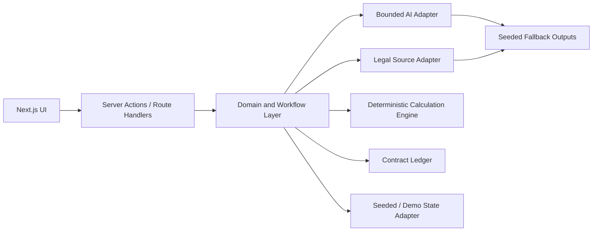
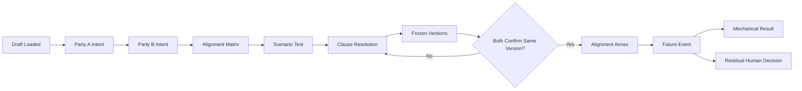
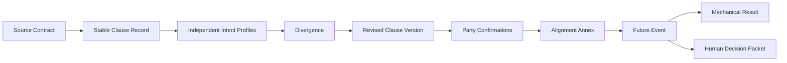
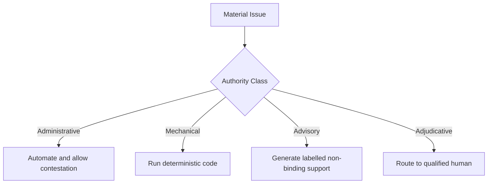

# System Requirements and Technical Architecture Specification

## I0-First Contract-Alignment Prototype

**Status:** Authoritative technical specification for the hackathon build  
**Scope:** One seeded Swiss-UK SaaS contract, bilateral pre-signature alignment, structured Alignment Annex and compact future-event continuity preview  
**Architecture principle:** The authoritative product is a versioned contract state and audit ledger, not a chatbot transcript.

## 1. Purpose

This document defines how the approved I0-first product and legal-governance rules are implemented as a lean, reliable hackathon prototype.

The system must support the locked flow:

```text
Draft
→ independent party expectations
→ divergence matrix
→ legal source
→ scenario test
→ revised clause
→ bilateral confirmation
→ Alignment Annex
→ future mechanical result
→ residual human decision
```

The technical design must preserve five properties throughout the flow:

1. **source traceability**;
2. **party separation before comparison**;
3. **version integrity**;
4. **deterministic mechanical calculation**;
5. **human ownership of consequential legal judgment**.

## 2. P0 Architecture Decision

The hackathon prototype uses one deployable web application rather than separate frontend and backend repositories.

Recommended structure:

```text
app/
  page.tsx
  api/
    align/route.ts
    legal-source/route.ts
    clause-options/route.ts
    annex/route.ts
components/
  intent/
  alignment/
  scenario/
  annex/
  shared/
lib/
  domain/
  workflows/
  calculations/
  ai/
  retrieval/
  ledger/
  validation/
data/
  seeded-contract/
  seeded-outputs/
docs/
```

The application may use Next.js, TypeScript and shadcn/ui. Server-side route handlers or server actions provide the backend boundary. P0 does not require microservices, queues, a separate API server or production persistence.

## 3. System Components

| Component | Responsibility |
| --- | --- |
| Party Intent Workspace | Capture and validate each party’s private expectations for the three clause groups |
| Alignment Engine | Compare party profiles with the source draft and create structured divergences |
| Legal Constraint Retriever | Return one relevant, source-linked legal constraint for a selected divergence |
| Scenario Engine | Apply both parties’ assumptions to the seeded outage and expose different outcomes |
| Clause Resolution Workspace | Generate, edit, version, freeze and confirm revised clause language |
| Confirmation Engine | Enforce exact-version bilateral confirmation rules |
| Alignment Annex Generator | Compile only bilaterally confirmed state into a structured annex |
| Future Event Engine | Apply the confirmed formula and evidence rules to the later outage |
| Authority Router | Route mechanical work to code and residual legal questions to a qualified human |
| Contract Ledger | Record source, actor, version, action, status and timestamp for material events |
| Demo Controller | Load, reset and advance the seeded case; switch roles; activate cached fallbacks |

## 4. Frontend Architecture

The application contains four primary surfaces.

### 4.1 Independent Party Intent

Requirements:

- explicit Party A and Party B role context;
- separate forms for uptime, liability and dispute-resolution architecture;
- bounded fields for expected outcome, interpretation, risk tolerance, evidence preference and legal preference;
- save and completion state;
- private-by-default visibility;
- source clause available beside the form;
- no display of the other party’s intent before comparison is activated.

### 4.2 Alignment Matrix

Requirements:

- one row or card per material divergence;
- symmetrical Party A and Party B columns;
- source clause excerpt and location;
- commercial consequence;
- legal constraint and source link;
- authority class;
- materiality and status;
- correction and contestation controls;
- route into scenario testing or clause resolution.

### 4.3 Scenario and Clause Resolution

Requirements:

- seeded outage facts;
- result under Party A assumptions;
- result under Party B assumptions;
- explicit explanation of the variable causing divergence;
- revised clause options;
- editable clause text;
- visible clause version;
- freeze action;
- separate confirmation controls;
- automatic invalidation of stale confirmations after editing.

### 4.4 Alignment Annex and Future Preview

Requirements:

- structured annex summary;
- exact agreed clause text and versions;
- formula, inputs and evidence hierarchy;
- governing law, seat, language and rules;
- party confirmations and timestamps;
- future outage inputs;
- deterministic calculation trace;
- residual issue card stating why human judgment is required;
- complete event ledger.

## 5. Authoritative Domain Model

The central object is `ContractAlignmentState`.

```ts
type ContractAlignmentState = {
  contract: ContractRecord
  parties: PartyRecord[]
  clauses: ClauseRecord[]
  intentProfiles: PartyIntentProfile[]
  divergences: DivergenceRecord[]
  legalConstraints: LegalConstraintRecord[]
  scenarios: ScenarioRecord[]
  clauseOptions: ClauseVersionRecord[]
  confirmations: ClauseConfirmation[]
  annex?: AlignmentAnnex
  futureEvent?: FutureEventRecord
  residualIssue?: HumanDecisionPacket
  ledger: LedgerEvent[]
}
```

### 5.1 Core records

`ContractRecord`

- contract ID;
- title;
- jurisdictional context;
- source file;
- source hash;
- current draft version.

`ClauseRecord`

- stable topic ID;
- source clause ID;
- title;
- original text;
- document location;
- clause group;
- current resolution status.

`PartyIntentProfile`

- party ID;
- clause topic ID;
- expected outcome;
- intended interpretation;
- risk tolerance;
- evidence preference;
- legal architecture preference;
- rationale;
- version;
- status;
- timestamps.

`DivergenceRecord`

- divergence ID;
- clause topic ID;
- Party A position;
- Party B position;
- source clause reference;
- divergence type;
- materiality;
- commercial consequence;
- authority class;
- legal constraint IDs;
- status;
- contestation history.

`ClauseVersionRecord`

- stable clause topic ID;
- integer version;
- complete clause text;
- formula specification;
- input definitions;
- evidence hierarchy;
- remedy;
- legal architecture;
- authority class;
- unresolved matters;
- frozen status;
- generated-by metadata.

`ClauseConfirmation`

- party ID;
- clause topic ID;
- exact clause version;
- confirmation state;
- timestamp;
- demo actor metadata.

`AlignmentAnnex`

- annex ID;
- contract ID;
- included clause versions;
- confirmation references;
- generation timestamp;
- unresolved matters;
- annex schema version.

`FutureEventRecord`

- event ID;
- annex ID;
- applicable clause version;
- inputs and sources;
- formula version;
- calculation trace;
- result status.

`HumanDecisionPacket`

- issue ID;
- issue statement;
- relevant confirmed clause state;
- Party A position;
- Party B position;
- available evidence;
- missing evidence;
- legal constraint;
- requested human determination;
- authority class.

## 6. State Machine

The P0 lifecycle is:

```text
DRAFT_LOADED
→ PARTY_A_INTENT_COMPLETE
→ PARTY_B_INTENT_COMPLETE
→ COMPARISON_READY
→ DIVERGENCES_IDENTIFIED
→ SCENARIO_TESTED
→ CLAUSE_OPTIONS_READY
→ CLAUSES_FROZEN
→ BILATERALLY_CONFIRMED
→ ANNEX_GENERATED
→ FUTURE_EVENT_APPLIED
→ MECHANICAL_RESULT_COMPLETE
→ RESIDUAL_HUMAN_REVIEW
```

Rules:

- comparison cannot run until both intent profiles are complete;
- annex generation cannot run until every included clause is frozen and bilaterally confirmed;
- editing a frozen clause creates `version + 1` and removes confirmations for the earlier version from the active state;
- the future event must reference the annex and exact clause version used;
- a disputed material future input blocks a single authoritative mechanical result;
- residual consequential-loss analysis always ends in `RESIDUAL_HUMAN_REVIEW`.

## 7. Bilateral Confirmation Protocol

The confirmation engine is deterministic application logic.

```ts
function isBilaterallyConfirmed(
  clause: ClauseVersionRecord,
  confirmations: ClauseConfirmation[]
): boolean {
  const active = confirmations.filter(
    (item) =>
      item.clauseTopicId === clause.clauseTopicId &&
      item.clauseVersion === clause.version &&
      item.state === "confirmed"
  )

  return new Set(active.map((item) => item.partyId)).size === 2
}
```

Required behaviour:

- each clause topic has a stable identifier;
- each material text edit creates a new integer version;
- confirmation references the exact version;
- both parties confirm independently;
- version mismatch, missing response or stale confirmation prevents agreement;
- the UI states that demo confirmation records process state and is not an electronic signature;
- annex generation selects confirmed versions only.

## 8. Document and Source Processing

P0 uses one seeded contract and may rely on pre-segmented source data.

Minimum pipeline:

```text
seeded source file
→ source hash
→ clause segmentation
→ stable clause IDs
→ source locations and excerpts
→ structured contract record
→ retrieval index or local source map
```

Live upload, OCR and general document classification are P1 or roadmap features. The demo source must still preserve:

- original file;
- stable document ID;
- source hash;
- page or section location;
- exact excerpt;
- clause identifier;
- extraction status.

## 9. AI and Model Orchestration

AI functions are bounded tools, not autonomous agents with legal authority.

### 9.1 Permitted P0 AI tasks

- propose structured extraction from the seeded draft;
- compare two intent profiles;
- draft divergence explanations;
- identify commercial consequences;
- draft one legal-research query;
- summarise one retrieved legal constraint;
- propose revised clause options;
- draft the residual human-decision packet.

### 9.2 Structured outputs

Every AI response used by application state must validate against a schema. Minimum metadata:

- output ID;
- task type;
- source references;
- proposition or proposed text;
- authority class;
- uncertainty;
- missing information;
- model identifier;
- prompt or workflow version;
- generated timestamp.

### 9.3 Application-controlled functions

Normal TypeScript code controls:

- role visibility;
- state transitions;
- clause versions;
- freezing;
- confirmation matching;
- annex eligibility;
- deterministic calculation;
- authority routing;
- ledger creation.

The model cannot directly set a clause to confirmed, generate an authoritative annex, issue a legal decision or alter the ledger history.

### 9.4 Demo fallback

Every live AI or retrieval step must have a seeded valid fallback. The fallback must use the same schema and produce the same visible workflow state.

Recommended pattern:

```text
live call succeeds → validate → store result
live call fails or times out → load seeded result → mark execution mode as cached
```

## 10. Legal-Source Retrieval

P0 retrieves or displays one relevant legal constraint for a selected divergence.

The source record must include:

- title;
- issuing authority or publisher;
- jurisdiction;
- date or version;
- relevant passage;
- citation or URL;
- retrieval timestamp;
- explanation of relevance;
- advisory status.

The system must distinguish:

- contract source;
- legal source;
- party preference;
- AI-generated interpretation.

A retrieved legal source informs clause resolution but does not independently select governing law, arbitral seat, rules or language.

## 11. Deterministic Scenario and Future Calculation

The outage scenario and later service-credit result use deterministic code.

The calculation specification must expose:

- formula ID and version;
- measurement period;
- total service minutes;
- excluded minutes;
- downtime minutes;
- measured uptime;
- threshold;
- credit rate or amount;
- rounding rules;
- source and confirmation status for every input;
- intermediate values;
- final result.

The seeded accepted state produces a CHF 3,000 service credit.

The calculation service must be a pure function:

```ts
type CalculationResult = {
  formulaVersion: string
  inputs: CalculationInput[]
  steps: CalculationStep[]
  result: number
  currency: "CHF"
  status: "scenario" | "mechanical-result" | "blocked"
}
```

Identical inputs and formula versions must always produce identical output and trace.

## 12. Authority Routing

The technical system implements four authority classes:

| Class | P0 treatment |
| --- | --- |
| Administrative | Automated extraction, comparison, organisation and logging |
| Mechanical | Deterministic scenario and service-credit calculation |
| Advisory | AI-assisted divergence analysis, legal constraint summary and clause drafting |
| Adjudicative | Human-only determination; system prepares a focused packet |

Hard routing rules must not depend solely on model confidence.

The consequential-loss issue routes to a qualified human because it involves disputed classification, causation, evidence and legal effect.

## 13. Contract Ledger

The ledger is append-oriented and records every material event.

```ts
type LedgerEvent = {
  id: string
  caseId: string
  actorId: string
  actorRole: string
  eventType: string
  objectType: string
  objectId: string
  priorVersion?: number
  newVersion?: number
  priorStatus?: string
  newStatus?: string
  sourceIds?: string[]
  reason?: string
  executionMode: "deterministic" | "live-ai" | "cached-ai" | "human"
  timestamp: string
}
```

Material events include:

- contract loaded;
- intent profile saved;
- comparison run;
- divergence created or contested;
- legal source linked;
- scenario calculated;
- clause option generated;
- clause edited;
- version frozen;
- confirmation recorded or invalidated;
- annex generated;
- future event loaded;
- mechanical result calculated;
- human-review issue created.

The ledger must never present an AI output as an established fact or a party confirmation as an electronic signature.

## 14. API Requirements

Suggested P0 endpoints or server actions:

| Operation | Input | Output |
| --- | --- | --- |
| `loadDemo()` | demo case ID | initial `ContractAlignmentState` |
| `saveIntent()` | party, clause, structured intent | updated profile and ledger event |
| `compareIntents()` | completed profiles and source clauses | divergences |
| `getLegalConstraint()` | divergence and jurisdiction context | structured source record |
| `runScenario()` | scenario facts and assumption set | deterministic comparison |
| `generateClauseOptions()` | divergence, source and legal constraint | versioned options |
| `editClause()` | clause version and text | new version, cleared active confirmations |
| `confirmClause()` | party and exact clause version | confirmation state |
| `generateAnnex()` | confirmed clause versions | structured annex |
| `applyFutureEvent()` | annex and event inputs | mechanical result and residual issue |
| `resetDemo()` | demo case ID | restored initial state |

All write operations validate role, state and version before mutation and create a ledger event.

## 15. Storage

P0 may use:

- checked-in seeded JSON for original and fallback data;
- in-memory state, browser-local state or a lightweight local database for demo progression;
- server-only environment variables for model and retrieval credentials.

P0 requires no production multi-tenancy or durable case store.

The architecture should keep domain types and repository interfaces separate so production persistence can later replace the demo adapter.

## 16. Security and Privacy

Minimum P0 controls:

- all model and retrieval calls execute server-side;
- credentials remain in server environment variables;
- party-private intent is filtered by role before rendering;
- route handlers validate role and permitted state transition;
- rendered user content is escaped;
- uploaded arbitrary content is outside P0;
- logs exclude secrets and unnecessary private intent text;
- demo data contains no real client information;
- external model training on submitted data is disabled where provider controls permit.

Production requirements such as verified identity, tenant isolation, encryption key management, retention, legal hold, data-subject workflows and incident response remain roadmap items.

## 17. Observability

The prototype should record:

- workflow stage;
- live or cached execution mode;
- model and retrieval failures;
- schema-validation failures;
- calculation failures;
- confirmation mismatches;
- annex-generation blocks;
- reset count;
- end-to-end demo completion time.

The demo interface should display a discreet fallback indicator when cached data is used, without interrupting the legal workflow.

## 18. Performance and Reliability

P0 targets:

- initial seeded state loads within two seconds under normal demo conditions;
- deterministic calculations complete within 100 milliseconds locally;
- state mutations complete within one second excluding live AI calls;
- live AI or retrieval calls use a bounded timeout and cached fallback;
- the full golden path completes in three minutes or less;
- reset restores an identical initial state;
- the workflow completes successfully three consecutive times before presentation.

## 19. Testing Requirements

### Unit tests

- comparison rules;
- clause version increment;
- stale-confirmation invalidation;
- bilateral confirmation matching;
- annex eligibility;
- service-credit calculation;
- authority routing;
- ledger-event creation.

### Integration tests

- both intent profiles to divergence matrix;
- divergence to scenario and clause options;
- edit, freeze and bilateral confirmation;
- confirmed clauses to annex;
- annex to future mechanical result and residual human issue;
- live-call failure to cached fallback.

### End-to-end tests

1. load and reset the seeded case;
2. complete Party A and Party B intent;
3. detect all seeded divergences;
4. display a legal constraint;
5. show different scenario outcomes;
6. edit and freeze revised clauses;
7. block annex generation after one confirmation;
8. allow annex generation after matching confirmations;
9. invalidate confirmations after a material edit;
10. calculate CHF 3,000 from the final annex;
11. route the CHF 60,000 consequential-loss issue to a human;
12. reconstruct the sequence from the ledger.

## 20. Technical Acceptance Criteria

The build is accepted when:

- all four product surfaces read and write one authoritative state;
- one party cannot inspect the other’s private intent before comparison;
- all seeded divergences link to source clauses;
- AI outputs validate against schemas;
- clause edits always create a new version;
- stale confirmations never satisfy bilateral agreement;
- annex generation uses confirmed versions only;
- the future event references the exact annex and clause versions;
- the mechanical result is reproducible;
- the residual legal issue cannot transition into an automated decision;
- all material changes produce ledger events;
- the complete demo survives live AI or retrieval failure through seeded fallback.

## 21. Required Diagrams

### 21.1 System architecture



### 21.2 I0 case-state lifecycle



### 21.3 Data lineage



### 21.4 Authority routing



## 22. Roadmap Boundary

The technical architecture may later support dispute intake, settlement workspaces, merits records, settlement confidentiality controls, arbitral handover and tribunal tools. None forms part of the P0 build.

The P0 continuity preview is intentionally compact. Its sole purpose is to prove that an aligned, structured contract state can later produce a mechanical result and isolate the remaining legal question cleanly.

## 23. Central Technical Rule

> **Every material output must be traceable to its source, party, version, authority class, transformation, confirmation state and timestamp. Every mechanical result must be reproducible. Every consequential legal judgment must remain human-owned.**
