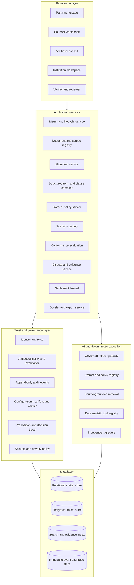
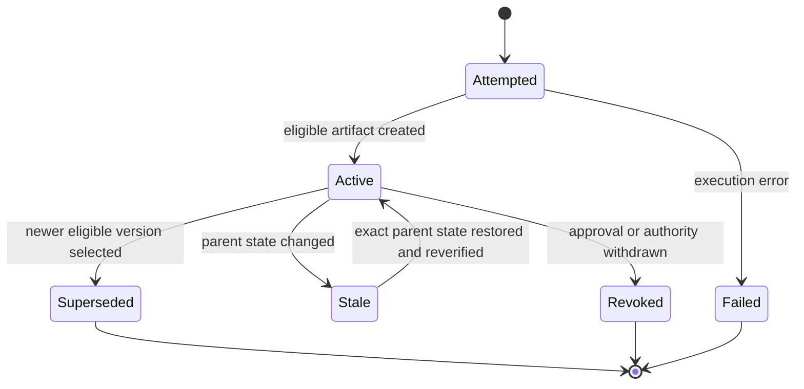

# ZIAAP Concept-to-Validated-Product Technical Roadmap

**Document type:** Product requirements, system architecture, sprint plan and complete implementation backlog

**Status:** Decision-complete strategic backlog; execution is stage-gated and later estimates remain provisional

**Current artifact classification:** High-fidelity interactive concept demonstrator, where “high-fidelity” refers specifically to workflow and interaction fidelity

**Category thesis:** **Computational Private Ordering**

**Target product model:** ZIAAP Contract Alignment, beginning with scenario-based pre-signature alignment for selected high-impact clauses in complex enterprise systems-integration MSAs.

**Current boundary:** The current repository remains C0 and does not implement or run Pilot 01. Lifecycle re-alignment, segregated mediation, arbitral handover and partner ownership are deferred hypotheses. The [Pilot 01 Protocol](../product/pilot-01-protocol.md) controls the active specification.

---

## 1. Executive decision

The current ZIAAP experience should be described as a **high-fidelity interactive concept demonstrator**, where high fidelity refers specifically to workflow and interaction fidelity, rather than a prototype. It communicates a coherent product thesis and simulates a full lifecycle, while the present implementation lacks the persistent multi-user state, authenticated bilateral action, independent evaluation, real evidence handling, runtime provenance, procedural challenge workflow and production controls required for a technical prototype.

The approved official description is:

> ZIAAP is a C0 high-fidelity interactive concept demonstrator, where high fidelity is limited to workflow and interaction. It uses synthetic, resettable, simulation-only state to illustrate Contract Alignment and deferred human-controlled architecture. It is not an implemented product, confidential matter system, pilot, legal appointment, operative award process or externally validated system.

The roadmap therefore uses the following maturity ladder:

| Level | Name | Evidence required | Planned milestone |
|---|---|---|---|
| C0 | Interactive concept demonstrator | Coherent three-layer, six-gate journey, synthetic fixtures, honest limitations | Current state |
| C1 | Review-grade concept demonstrator | Canonical state, truthful artifacts, structured contract integrity, clear funding roadmap | Sprint 4 |
| P1 | Functional proof of concept | Real persistence, separate parties, real systems-integration inputs and live divergence proposals | Sprint 9 |
| P2 | Testable Contract Alignment prototype | Sealed responses, confirmation, scenario comparison, typed legal status and exact version integrity | Sprint 19 |
| P3 | Deferred downstream prototype | Structured case production and human-neutral workflow only after an I0 Go/Narrow decision | No active milestone |
| V1 | Controlled Pilot 01 | Security controls, external evaluation and four supervised systems-integration alignment matters | Sprint 31 |
| R1 | Production product | Integrations, reliability, governance, administration and post-market monitoring | Sprint 34 |

The phrase **perfect concept** is defined here as a concept that is:

1. **Truthful:** every claim is bound to demonstrated evidence and a maturity level.
2. **Coherent:** contract text, executable rules, policy, artifacts and dossier share one canonical state.
3. **Testable:** the future resolution protocol can be interrogated repeatedly, while evaluation remains independent from model generation.
4. **Traceable:** inputs, rules, sources, tools, outputs, uncertainty, challenges and human actions are reconstructable.
5. **Understandable:** business owners can comprehend behaviour without reading technical traces, while experts can inspect full provenance.
6. **Human-controlled:** the AI increases analytical capacity and procedural consistency, while a properly appointed human retains legal authority.
7. **Fundable:** the concept shows both the invention and the specific research, engineering, legal and validation work that funding enables.

---

## 2. Product thesis

> **ZIAAP is a scenario-based contract-alignment system for complex commercial
> agreements. It converts selected clauses into concrete operational scenarios,
> collects the parties' independent expectations, identifies materially
> different outcomes, and produces a versioned record of what was aligned,
> deliberately left open, or incorporated into the contract.**

The initial wedge is limited to systems-integration MSAs. The former two-wedge
comparison and partner-owned institution were superseded as current execution
strategy on 2026-07-24. The larger I0–I2 architecture remains staged and must be
earned through I0 evidence.

ZIAAP Contract Alignment changes the sequence of contract review. For selected
high-impact clauses, the parties:

1. state their independent expectations;
2. identify hidden divergence;
3. preserve original and AI-normalised responses separately;
4. confirm or correct the representations before bilateral reveal;
5. resolve, consciously preserve or defer each material open point;
6. record the legal status and permitted use of each object; and
7. version-lock the result without claiming that software created legal effect.

The product is not autonomous contracting, mediation or arbitration. It is a
governed alignment environment. Any future process twin, mediation workspace or
tribunal handover is a separate extension with its own intended purpose,
permissions and authority.

### 2.1 Initial and deferred capabilities

| Capability | User value |
|---|---|
| Gate 1 alignment before conflict | Reveals where parties silently expect different operational outcomes |
| Gate 2 scenario testing | Tests selected wording against concrete dependencies, triggers and remedies |
| Typed alignment record | Preserves original and derived text, authority, status, use and version separately |
| Lifecycle re-alignment | Deferred extension triggered by later events or amendments |
| Segregated mediation | Deferred purpose-bound workspace with no automatic data transfer |
| Structured neutral handover | Deferred per-object export to independently authorised professionals or institutions |

### 2.2 Deferred Resolution Officer definition

The **AI Resolution Officer** is a deferred software role and governed system
capability. It is not part of the initial sales proposition, a legal office, an
arbitral institution, an arbitrator or an autonomous decision-maker. It may
structure, compare, retrieve, calculate, test, challenge, explain and prepare
reviewable analysis. A properly appointed human arbitrator retains procedural
authority, independent judgment and responsibility for any legally operative
decision.

### 2.3 Product boundaries

The roadmap preserves the following boundaries:

- ZIAAP supports and augments a human arbitrator; legal authority remains with the properly appointed human and applicable institution.
- Scenario testing measures declared-policy conformance, stability and sensitivity. It does not promise the outcome of a future dispute.
- Traceability covers recorded inputs, rules, evidence, sources, tools, outputs, uncertainty, challenges and human actions. It does not claim access to a complete private model chain of thought.
- Deterministic tools perform formal calculations. Language models analyse ambiguity, arguments, evidence relations and uncertainty within governed boundaries.
- Legal review boundaries, mandatory-law issues and unsupported jurisdictions remain explicit.

---

## 3. Actors and primary jobs

| Actor | Primary jobs |
|---|---|
| Business owner / commercial principal | Understand hidden risk, compare options, test the future resolution process, approve commercial governance |
| Counterparty representative | State independent expectations, negotiate balanced terms, challenge outputs and approve exact versions |
| Contract counsel | Review legal boundaries, sources, drafting, governing law and enforceability questions |
| Human arbitrator | Form an independent view, inspect evidence and AI analysis, control procedure and issue the legally operative decision |
| AI Resolution Officer | Compare, structure, calculate, surface counterarguments, identify uncertainty and prepare reviewable analyses |
| Arbitral institution / case manager | Administer appointment, procedural status, deadlines, permissions and institutional records |
| Evaluator / auditor | Test robustness, trace provenance, verify manifests, inspect bias, measure comprehension and validate claims |
| Security / privacy officer | Govern sensitive data, retention, access, providers, incidents and cross-border handling |
| Platform operator | Maintain reliable execution, model governance, observability, support and release controls |
| Arbitrator partner | Define professional standards, retain independent case judgment and govern the target institution |
| Engineering team | Build the shared production environment without appointment or live-case merits authority |
| Investor | Hold only governance rights consistent with no authority over appointments, proceedings or merits |

---

## 4. Target architecture



### 4.1 Canonical entities

The minimum canonical entity model comprises:

- Tenant, organisation, user, role, invitation and acting capacity
- Matter, lifecycle status, supported vertical and jurisdiction scope
- Contract document, source snapshot, clause and source location
- Party expectation profile and immutable submission version
- Divergence finding, structured option and unresolved issue
- Structured term, compiled clause, term digest and approval
- Constitution version, typed policy rule and escalation trigger
- Scenario suite, evaluation case, run, grader result and expert review
- Artifact envelope, execution attempt, eligibility state and invalidation event
- Protocol Configuration Manifest, acknowledgement and verifier result
- Dispute, issue, claim, defence, submission, relief and procedural objection
- Evidence item, proposition, challenge, response and evidence gap
- Settlement track, proposal provenance, response and permitted status
- Resolution Officer analysis, reasoning memorandum and uncertainty
- Human preassessment, issue-level action, rationale and final decision record
- Dossier, export profile, signature reference and validation evidence

### 4.2 Canonical artifact states



---

## 5. Three layers and six matter gates

| Layer | Gate | Product action | Primary output | Gate condition |
|---|---|---|---|---|
| I0 · Flight Plan | 1. Alignment | Compare expectations and resolve material divergence | Aligned structured terms | Exact bilateral approvals and current analysis |
| I0 · Flight Plan | 2. Configuration | Assemble the Constitution control plane and test observable behavior | Versioned Constitution and scenario artifacts | Bilateral acknowledgement and eligible results |
| I1 · Cockpit | 3. Appointment & Configuration Freeze | Complete any future human appointment and bind exact configuration | Appointment record and verified configuration manifest | Applicable appointment plus digest and approvals |
| I1 · Cockpit | 4. Case Production | Maintain claims, defences, facts, evidence, gaps, calculations, objections and uncertainty as structured state | Contestable case environment | Complete shared record and challenge rights |
| I2 · Captain in Command | 5. Independent Adjudication | Record independent human assessment and review the advisory reasoning memorandum | Human-controlled disposition | Independent merits review with zero algorithmic presumption |
| I2 · Captain in Command | 6. Award & Black Box | Produce any future human-signed award and preserve recorded procedure | Award plus procedural black box | Human signature and applicable institutional process |

At C0, Gate 3 appointment is fictional and Gate 6 is **Simulated Outcome &
Procedural Black Box**, never an award.

---

## 6. Release sequence and dependencies

```mermaid
flowchart LR
  S0[S0 Charter] --> S1[S1 Domain model] --> S2[S2 Artifact eligibility] --> S3[S3 Clause compiler] --> S4[S4 Review-grade concept]
  S4 --> S5[S5 Persistence] --> S6[S6 Identity] --> S7[S7 Ingestion] --> S8[S8 Expectations] --> S9[S9 AI alignment]
  S9 --> S10[S10 Negotiation] --> S11[S11 Deterministic tools] --> S12[S12 Annex] --> S13[S13 SaaS pack]
  S13 --> S14[S14 Typed Constitution] --> S15[S15 Scenario testing] --> S16[S16 Evaluation] --> S17[S17 Robustness] --> S18[S18 Runtime provenance] --> S19[S19 Manifest]
  S19 --> I0G{I0 Go or Narrow?}
  I0G --> S29[S29 I0 security] --> S30[S30 I0 external evaluation] --> S31[S31 Contract Alignment Pilot 01] --> S32[S32 Contract integrations] --> S33[S33 Reliability] --> S34[S34 Production governance]
  I0G -. separate downstream approval .-> S20[S20 Dispute intake] --> S21[S21 Evidence graph] --> S22[S22 Resolution Officer] --> S23[S23 Arbitrator cockpit] --> S24[S24 Challenge round] --> S25[S25 Settlement]
  S25 --> S26[S26 Decision trace] --> S27[S27 Replay] --> S28[S28 Procedural black box]
```



### 6.1 Parallelisation

The roadmap is written as a safe logical sequence. After Sprint 5, several workstreams can proceed in parallel:

- **Track A, Contract governance:** Sprints 7 to 13
- **Track B, AI policy and evaluation:** Sprints 14 to 18
- **Track C, Trust platform:** identity, artifacts, provenance, security and manifest
- **Track D, deferred dispute and arbitrator workflow:** Sprints 20 to 28 only after an I0 Go/Narrow decision and separate charter
- **Track E, Research and external validation:** study design can begin during Sprints 13 to 18

The 70-week figure is retained only as arithmetic across all 35 historical
sprint numbers. It is not an execution sequence because Sprints 20–28 are a
deferred branch. All dates after the authorised stage require re-estimation and
are planning assumptions, not commitments.

### 6.2 Stage-gated execution and re-estimation

This roadmap is a strategic backlog, not one indivisible implementation command. The 35 sprints express scope, dependencies and an evidence path; they do not constitute a 70-week upfront delivery commitment.

Execution rules:

- Authorise and fund one evidence stage at a time.
- Run one sprint per implementation goal unless a smaller goal is required by risk or repository structure.
- Treat later sprint estimates, architecture and story ordering as provisional until earlier evidence exists.
- After Sprint 4, stop for a C1 audit, external concept review, commercial review and full re-estimation of Sprints 5 to 34.
- After Sprint 9, stop for a P1 audit, user evidence review, architecture review and full re-estimation of Sprints 10 to 34.
- Continue only after an explicit **go, refine, narrow, or hold** decision.
- Preserve the complete backlog for strategic completeness while maintaining detailed, implementation-ready stories only for the currently authorised stage and the immediately following stage.

---

## 7. Detailed sprint plan and complete user-story backlog

### Sprint 0: Product charter, vocabulary and success model

**Phase:** Phase 0: Concept truth and program foundation

**Objective:** Define exactly what ZIAAP is, what the current artifact is, what each future maturity level means, and how success will be measured.

**Why this sprint exists:** The present interface is a high-fidelity interactive concept demonstrator at the workflow and interaction level. Clear maturity labels prevent the concept from overclaiming technical, legal or evidentiary capabilities and give investors a credible funding path.

**Depends on:** Current concept demonstrator, post-audit findings, founder vision.

**Unlocks:** All later architecture, copy, sprint gates and external review.

#### User stories

| ID | User story | Acceptance criterion |
|---|---|---|
| S0-US1 | As a business owner, I want a one-sentence explanation of ZIAAP, so that I understand the value before reading technical details. | The approved sentence explains alignment before signing, testable dispute governance, AI augmentation and retained human authority. |
| S0-US2 | As a reviewer, I want each maturity level labelled consistently, so that I can distinguish concept, proof of concept, prototype, pilot and production. | A maturity matrix defines evidence required for each label and every product surface uses the same terms. |
| S0-US3 | As a product team, I want a canonical glossary, so that terms such as alignment, calibration, conformance, validation, manifest, resolution officer and arbitrator remain unambiguous. | The glossary is versioned, linked from requirements, and includes approved and reserved terms. |
| S0-US4 | As a legal lead, I want a claims register, so that public language stays within demonstrated capability. | Each external claim has an owner, evidence source, permitted wording and maturity threshold. |
| S0-US5 | As a program sponsor, I want measurable release gates, so that funding and development decisions are based on evidence. | Each milestone has product, technical, legal, UX and evaluation exit criteria. |

#### Test plan

- Terminology lint across interface and documentation.
- Claims review by product and legal leads.
- Comprehension test with internal reviewers who have not seen the concept.
- Traceability check from each public claim to a release gate and evidence source.

#### Required sprint artifacts

- Product charter
- Maturity model
- Canonical glossary
- Claims register
- Release scorecard

#### Exit gate

Every stakeholder can describe ZIAAP consistently and classify the current artifact as an interactive concept demonstrator.

---

### Sprint 1: Canonical domain model and lifecycle state machine

**Phase:** Phase 0: Concept truth and program foundation

**Objective:** Create the authoritative model for matters, parties, contract state, protocol state, artifacts, dispute state and human decisions.

**Why this sprint exists:** Every later function depends on one coherent state model. Local flags and duplicated status logic create contradictions, stale artifacts and unsafe transitions.

**Depends on:** Sprint 0 terminology and release model.

**Unlocks:** Sprint 2 eligibility, Sprint 3 clause compiler, persistence, APIs and dossiers.

#### User stories

| ID | User story | Acceptance criterion |
|---|---|---|
| S1-US1 | As a platform engineer, I want one canonical matter schema, so that every interface and service interprets the same state. | The schema covers identity, contract, alignment, protocol, evaluation, manifest, dispute, settlement, human decision and dossier references. |
| S1-US2 | As a user, I want every stage transition to have explicit prerequisites, so that the system explains what is complete and what remains open. | A pure transition function returns allowed, blocked and reason codes for every lifecycle action. Only the deterministic procedural kernel can commit authoritative state; a model output cannot invoke a transition. |
| S1-US3 | As an auditor, I want every material state change represented as an event, so that the complete lifecycle can be reconstructed. | Events include actor, role, object, prior version, new version, reason, timestamp and correlation ID. |
| S1-US4 | As a developer, I want derived states calculated from canonical data, so that UI-only flags cannot contradict the matter record. | No eligibility, readiness or completion status is stored solely in component state. |
| S1-US5 | As a product owner, I want explicit terminal and rollback states, so that failed runs, revoked approvals and superseded versions remain understandable. | State diagrams cover failure, revocation, supersession, reopening and closure. |

#### Test plan

- Schema validation tests for valid and invalid state combinations.
- State-machine property tests for unreachable and contradictory transitions.
- Event replay test that reconstructs canonical state.
- Mutation tests proving all behavior-affecting edits invalidate the correct descendants.

#### Required sprint artifacts

- Domain model specification
- State-transition diagrams
- Event taxonomy
- Canonical TypeScript schemas
- Migration strategy

#### Exit gate

No screen derives legal, artifact or lifecycle readiness from local state.

---

### Sprint 2: Artifact envelope, eligibility and invalidation

**Phase:** Phase 0: Concept truth and program foundation

**Objective:** Create one artifact model and one eligibility projection used by every gate, badge, manifest and dossier.

**Why this sprint exists:** The current concept can preserve stale outputs while showing them as available elsewhere. A shared eligibility layer is the trust foundation for the entire system.

**Depends on:** Sprint 1 canonical state and events.

**Unlocks:** Reliable alignment artifacts, evaluations, manifests, dispute outputs and dossiers.

#### User stories

| ID | User story | Acceptance criterion |
|---|---|---|
| S2-US1 | As a user, I want every AI, deterministic and human artifact to show its status, so that I know whether it is current, stale, failed, superseded or revoked. | Every artifact uses a shared envelope with type, version, parents, hash, actor, execution status, authority status and legal effect. |
| S2-US2 | As a system, I want successful executions separated from failed attempts, so that a failed run never becomes an eligible artifact. | Execution attempts and artifacts have separate schemas and lifecycle rules. Every model result is a proposal artifact with `legalEffect: false`; it can affect authoritative state only through validation and an authorised transition. |
| S2-US3 | As an auditor, I want an explanation for every ineligible artifact, so that the system is inspectable rather than silently blocked. | Eligibility returns machine-readable reason codes and plain-language explanations. |
| S2-US4 | As a party, I want acknowledgements bound to an exact artifact digest, so that later edits automatically clear prior approval. | Acknowledgements reference artifact ID, content digest, actor identity and version. |
| S2-US5 | As a dossier reader, I want availability calculated by the same rules used in the workflow, so that the final record never contradicts an earlier stage. | Lifecycle gates, UI, manifest and dossier import the same eligibility projection. |

#### Test plan

- Table-driven tests for every artifact state and reason.
- Cross-surface consistency tests comparing workflow, manifest and dossier status.
- Failure recovery tests preserving prior artifacts as inactive.
- Digest-bound acknowledgement tests after any parent change.

#### Required sprint artifacts

- ArtifactEnvelope schema
- ExecutionAttempt schema
- Eligibility projection
- Invalidation dependency graph
- Shared status components

#### Exit gate

One pure eligibility function controls all artifact use and presentation.

---

### Sprint 3: Structured contract state and deterministic clause compiler

**Phase:** Phase 0: Concept truth and program foundation

**Objective:** Make structured commercial terms the source of truth and derive human-readable clauses from versioned templates.

**Why this sprint exists:** The most serious current defect allows the legal text and executable terms to diverge. Contract text, calculations and later dispute logic must remain semantically bound.

**Depends on:** Sprints 1 and 2.

**Unlocks:** Reliable alignment, calculators, annexes, protocol manifests and later dispute application.

#### User stories

| ID | User story | Acceptance criterion |
|---|---|---|
| S3-US1 | As a business owner, I want commercial choices represented as clear structured controls, so that I can understand exactly what will execute. | Typed term models cover uptime, evidence hierarchy, maintenance, credits, liability, governing law, seat, rules, language and arbitrator count. |
| S3-US2 | As counsel, I want clause text generated from the approved structured terms, so that the contract and executable state remain aligned. | A versioned compiler produces deterministic clause text and a terms digest. |
| S3-US3 | As a party, I want any term change to create a new version, so that earlier confirmations cannot survive a material edit. | Changing any structured field increments the decision version and invalidates confirmations, calculations, manifest and downstream artifacts. |
| S3-US4 | As a legal product designer, I want template variants and legal-review boundaries, so that different commercial choices produce precise language without implying universal enforceability. | Templates identify jurisdiction, review status, unresolved legal questions and permitted use. |
| S3-US5 | As an auditor, I want the system to reject text that differs from compiled terms, so that contradictory representations cannot be frozen. | Persistence and API validation compare stored text with compiler output and fail closed on mismatch. |

#### Test plan

- Golden tests for every structured option and generated clause.
- Property tests across boundary values and combinations.
- Round-trip tests from structured terms to clause to digest.
- Negative tests for altered text, stale confirmation and calculator mismatch.

#### Required sprint artifacts

- StructuredTerms schemas
- Clause template registry
- Deterministic compiler
- Terms digest
- Migration of synthetic fixture

#### Exit gate

No matter can contain legally displayed text that conflicts with executable structured terms.

---

### Sprint 4: Truthful concept demonstrator v2

**Phase:** Phase 0: Concept truth and program foundation

**Objective:** Rebuild the existing experience around I0–I2 and the six matter gates on corrected state, terminology and eligibility foundations.

**Why this sprint exists:** A polished concept should demonstrate the invention without implying that unbuilt capabilities already exist. This is the first fundable, externally reviewable milestone.

**Depends on:** Sprints 0 to 3.

**Unlocks:** Functional proof-of-concept work and external concept validation.

#### User stories

| ID | User story | Acceptance criterion |
|---|---|---|
| S4-US1 | As a first-time visitor, I want the opening to lead with testing the dispute-resolution system before signing, so that the core invention is immediately clear. | The first screen communicates alignment, protocol testing, human authority and future dispute continuity in under one minute. |
| S4-US2 | As a reviewer, I want six consistently named gates, so that navigation and operating-model language match. | Sidebar, footer, black box and documentation use the same six-gate model. |
| S4-US3 | As a user, I want every illustrative action labelled as curated simulation, so that I can distinguish mock data from real execution. | Illustrative, live-unverified, deterministic and human-simulated outputs use visually distinct authority labels. |
| S4-US4 | As an investor, I want to see what funding would build next, so that current limitations read as a roadmap rather than product confusion. | Each unbuilt capability links to the relevant milestone and validation requirement. |
| S4-US5 | As a researcher, I want a guided walkthrough and a free-exploration mode, so that comprehension and behaviour can be studied separately. | The concept supports scripted review, task logging and resettable exploration. |

#### Test plan

- Desktop and mobile end-to-end walkthrough.
- Accessibility audit for navigation, labels, focus and contrast.
- Internal comprehension study using task completion and unaided explanation.
- Snapshot tests ensuring all authority and maturity labels remain present.

#### Required sprint artifacts

- Concept demonstrator v2
- Guided review script
- Concept evidence dossier
- Known-limitations register
- Funding roadmap summary

#### Exit gate

External reviewers can understand the invention, current evidence and funding requirement without interpreting the concept as a working arbitration product.

---

### Sprint 5: Persistent matter service and server authority

**Phase:** Phase 1: Functional proof of concept

**Objective:** Move canonical matter state, artifacts and events to a server-side persistence layer with transactional updates.

**Why this sprint exists:** A functioning proof of concept requires state that survives sessions, supports multiple actors and protects lifecycle integrity beyond one browser.

**Depends on:** Sprints 1 to 4.

**Unlocks:** Identity, document ingestion, multi-party workflows and real execution.

#### User stories

| ID | User story | Acceptance criterion |
|---|---|---|
| S5-US1 | As a user, I want my matter to persist, so that I can continue work across sessions and devices. | Matter creation, retrieval, update and archival use server-authoritative APIs. |
| S5-US2 | As a platform engineer, I want optimistic concurrency control, so that simultaneous edits cannot silently overwrite each other. | Every write includes an expected version and returns a conflict with a structured diff when stale. |
| S5-US3 | As an auditor, I want append-only events, so that state changes remain reconstructable even after later edits. | Material writes create immutable audit events in the same transaction. |
| S5-US4 | As an operator, I want isolated environments and seeded demo matters, so that demonstrations remain reproducible without touching pilot data. | Development, review, pilot and production environments have separate data and configuration. |
| S5-US5 | As a developer, I want idempotent APIs, so that retries do not duplicate approvals, artifacts or transitions. | Mutating endpoints accept idempotency keys and have retry tests. |

#### Test plan

- Database migration and rollback tests.
- Concurrent edit and stale-version tests.
- Event and state transactional consistency tests.
- API contract tests and persistence restart tests.

#### Required sprint artifacts

- Matter API
- Persistence schema
- Event store
- Concurrency model
- Seed and reset tooling

#### Exit gate

Two independent sessions can safely work on the same synthetic matter with consistent state.

---

### Sprint 6: Identity, roles and bilateral participation

**Phase:** Phase 1: Functional proof of concept

**Objective:** Create authenticated, role-separated workspaces for parties, counsel, arbitrators, case managers and auditors.

**Why this sprint exists:** The value proposition depends on independent party positions and trusted acknowledgements. One operator clicking every role proves only UI flow.

**Depends on:** Sprint 5.

**Unlocks:** Private expectation capture, bilateral approvals, real challenge rounds and pilot governance.

#### User stories

| ID | User story | Acceptance criterion |
|---|---|---|
| S6-US1 | As a party representative, I want an invitation tied to my organisation and role, so that I see only the actions and information relevant to me. | Invitations expire, are role-scoped and require identity verification appropriate to the environment. |
| S6-US2 | As a party, I want my expectation profile private until submission, so that I can state my interpretation without strategic leakage. | Draft profiles are accessible only to the submitting party and authorised counsel. |
| S6-US3 | As counsel, I want delegated drafting and approval rights, so that business and legal responsibilities remain distinct. | Permissions separate drafting, reviewing, submitting, approving and observing. |
| S6-US4 | As an arbitrator, I want a separate workspace and conflict disclosure flow, so that human authority remains institutionally distinct. | Arbitrator access begins only after the relevant simulated or pilot appointment transition. |
| S6-US5 | As an auditor, I want actor attribution on every approval and artifact, so that responsibility is traceable. | Events record authenticated user, organisation, role, authentication strength and acting capacity. |

#### Test plan

- Role-based access-control matrix tests.
- Private-profile confidentiality tests.
- Invitation expiry and revocation tests.
- Cross-tenant and cross-role penetration tests.

#### Required sprint artifacts

- Identity service
- Role and permission model
- Invitation flow
- Organisation workspaces
- Actor attribution

#### Exit gate

Two parties can participate independently, with verifiable separation of access and action.

---

### Sprint 7: Contract ingestion and source registry

**Phase:** Phase 1: Functional proof of concept

**Objective:** Accept real documents in controlled formats, preserve source snapshots, and create a verifiable clause and source registry.

**Why this sprint exists:** Alignment and later dispute analysis require reliable provenance. A copied synthetic clause is insufficient for a functioning proof of concept.

**Depends on:** Sprints 5 and 6.

**Unlocks:** Expectation mapping, divergence detection, evidence citations and manifest completeness.

#### User stories

| ID | User story | Acceptance criterion |
|---|---|---|
| S7-US1 | As counsel, I want to upload a contract draft, so that ZIAAP can work from the actual text under review. | The service accepts supported formats, stores the original, creates a content hash and extracts structure without altering the source. |
| S7-US2 | As a reviewer, I want every extracted clause linked to its original location, so that I can verify context and wording. | Clause references include document version, page or section, offsets and source snapshot digest. |
| S7-US3 | As a user, I want uncertain extraction highlighted, so that I can correct structure before analysis begins. | Low-confidence segmentation is queued for human confirmation. |
| S7-US4 | As a legal researcher, I want curated legal sources stored as snapshots, so that later outputs cite the exact material used at the time. | Source records preserve authority type, jurisdiction, retrieval date, text excerpt, URL and content digest. |
| S7-US5 | As a privacy officer, I want ingestion controls, so that sensitive documents follow the matter’s retention and access policy. | Uploads are scanned, encrypted, classified and governed by retention settings. |

#### Test plan

- File parsing fixtures across supported formats.
- Source-location round-trip tests.
- Hash stability and tamper-detection tests.
- Malicious file, oversized file and access-control tests.

#### Required sprint artifacts

- Document ingestion service
- Clause registry
- Source snapshot registry
- Extraction review UI
- Document provenance model

#### Exit gate

A reviewer can move from any analysed proposition to the exact source text and snapshot.

---

### Sprint 8: Independent expectation capture and alignment inputs

**Phase:** Phase 1: Functional proof of concept

**Objective:** Build the bilateral process through which each party records operational, commercial and legal expectations against the same draft.

**Why this sprint exists:** Hidden divergence becomes valuable only when inputs are genuinely independent, structured enough to compare and comfortable for business users.

**Depends on:** Sprints 6 and 7.

**Unlocks:** AI divergence detection and negotiated term resolution.

#### User stories

| ID | User story | Acceptance criterion |
|---|---|---|
| S8-US1 | As a business owner, I want guided questions for each material clause, so that I can explain what I believe the contract means without drafting legal prose. | The interface captures expected operation, evidence, remedy, exceptions, risk allocation and unresolved concerns. |
| S8-US2 | As counsel, I want to add legal assumptions and review boundaries, so that commercial expectations remain distinguishable from legal conclusions. | Legal fields have source and confidence metadata. |
| S8-US3 | As a party, I want to preview and submit an exact profile version, so that later comparisons use a stable record. | Submission creates a digest-bound immutable version while retaining editable future drafts. |
| S8-US4 | As a case manager, I want completeness indicators, so that analysis starts with sufficient input rather than guessed intent. | Required and optional fields are defined by the selected vertical rule pack. |
| S8-US5 | As an international user, I want expectations recorded in my working language and normalised for comparison, so that language differences do not become hidden commercial differences. | Original language is preserved and machine translation is versioned and reviewable. |

#### Test plan

- Usability tests with business users on plain-language prompts.
- Profile versioning and confidentiality tests.
- Completeness rule tests by clause type.
- Translation provenance and side-by-side review tests.

#### Required sprint artifacts

- Expectation questionnaire engine
- Private draft workflow
- Submission versioning
- Vertical completeness rules
- Multilingual representation

#### Exit gate

Two independent parties can submit stable, reviewable expectation profiles against the same contract.

---

### Sprint 9: AI divergence detection with source-linked findings

**Phase:** Phase 1: Functional proof of concept

**Objective:** Implement real AI-supported comparison that detects unforeseen semantic, commercial, evidentiary and legal divergence.

**Why this sprint exists:** This is the load-bearing AI feature. It must discover differences rather than reproduce a prewritten answer embedded in the prompt.

**Depends on:** Sprints 7 and 8, model gateway foundation.

**Unlocks:** Negotiation workspace, structured term resolution and measurable AI value.

#### User stories

| ID | User story | Acceptance criterion |
|---|---|---|
| S9-US1 | As a party, I want the system to identify where our expectations differ, so that we can resolve important misunderstandings before signing. | The engine returns variable numbers of findings based on the actual inputs, with severity and confidence. |
| S9-US2 | As counsel, I want every finding linked to contract text, party statements and relevant sources, so that I can verify the basis. | Each finding uses typed citations and exposes unsupported or unresolved propositions. |
| S9-US3 | As a business owner, I want the practical consequence explained, so that I understand why a divergence matters commercially. | Findings include operational effect, likely dispute trigger and cost-of-inaction narrative without predicting an award. |
| S9-US4 | As a party, I want balanced representation of both positions, so that the analysis does not collapse one side into the other. | The output preserves separate assertions and records symmetry checks. |
| S9-US5 | As an evaluator, I want the generation prompt separated from answer keys, so that performance can be measured honestly. | Prompts contain schema, task and safety constraints; hidden evaluation references remain server-side and outside generation context. |

#### Test plan

- Blind evaluation on unseen clause and expectation pairs.
- Issue-recall, false-positive, unsupported-finding and citation-validity metrics.
- Party-order and wording perturbation tests.
- Human review comparing AI findings with independent contract lawyers.

#### Required sprint artifacts

- Alignment analysis service
- Typed finding schema
- Citation resolver
- Prompt registry
- Initial alignment evaluation set

#### Exit gate

The system detects and explains material divergence on unseen synthetic and de-identified cases.

---

### Sprint 10: Negotiation workspace and option generation

**Phase:** Phase 2: Alignment and contract governance

**Objective:** Turn each divergence into a structured, bilateral decision process with commercial options, legal boundaries and consequences.

**Why this sprint exists:** Detection creates value only when parties can resolve the issue without losing provenance or introducing hidden contradictions.

**Depends on:** Sprint 9 and structured terms from Sprint 3.

**Unlocks:** Executable rules, annex generation and protocol configuration.

#### User stories

| ID | User story | Acceptance criterion |
|---|---|---|
| S10-US1 | As a party, I want multiple resolution options for each divergence, so that we can compare simplicity, cost, risk and operational burden. | Options include structured terms, generated clause text, trade-offs, evidence requirements and unresolved legal review. |
| S10-US2 | As counsel, I want to author or amend an option through structured controls, so that legal language remains compiled from approved state. | Custom options use the same typed schemas and compiler as system-generated options. |
| S10-US3 | As both parties, I want a discussion and proposal history, so that the negotiation sequence remains traceable. | Comments, proposals, withdrawals and selections are versioned and attributed. |
| S10-US4 | As a business owner, I want scenario-based comparison of options, so that I can see how each commercial rule behaves before choosing. | Option cards can run deterministic examples and show sensitivity ranges. |
| S10-US5 | As a legal reviewer, I want unresolved questions carried forward explicitly, so that agreement on commercial terms does not masquerade as a legal conclusion. | Options preserve mandatory-law and jurisdictional review flags. |

#### Test plan

- Option compiler and schema tests.
- Negotiation sequence and concurrency tests.
- Scenario comparison tests across boundary cases.
- Usability study measuring whether parties understand trade-offs.

#### Required sprint artifacts

- Resolution option engine
- Negotiation history
- Custom option builder
- Scenario comparison UI
- Unresolved-issue register

#### Exit gate

Every selected option is structured, explainable, versioned and traceable to the divergence it resolves.

---

### Sprint 11: Deterministic rules, calculators and evidence specifications

**Phase:** Phase 2: Alignment and contract governance

**Objective:** Build a governed tool layer for calculations and formal contract operations that the model can call but cannot silently replace.

**Why this sprint exists:** Computable terms provide precision, repeatability and trust. They also separate arithmetic and formal logic from probabilistic language-model output.

**Depends on:** Sprint 10.

**Unlocks:** Reliable scenario lab, later dispute application and audit trace.

#### User stories

| ID | User story | Acceptance criterion |
|---|---|---|
| S11-US1 | As a business owner, I want contractual formulas executed transparently, so that I can verify inputs, steps and outputs. | Each tool run exposes rule version, input values, formula, intermediate steps, result and boundary conditions. |
| S11-US2 | As counsel, I want evidence requirements attached to each executable rule, so that the calculation runs only when required facts are confirmed. | Rules define source priority, missing-data states and contested-input behaviour. |
| S11-US3 | As an arbitrator, I want disputed premises separated from mechanical calculations, so that a correct formula never decides an unresolved fact. | Tool eligibility checks fact status before execution. |
| S11-US4 | As an auditor, I want deterministic tool versions included in provenance, so that calculations can be replayed. | Tool code digest, rule digest and execution trace are stored. |
| S11-US5 | As a developer, I want a safe tool interface for AI orchestration, so that models can request permitted operations without changing rules or inputs. | Tool calls are schema-validated, permissioned and logged. |

#### Test plan

- Known-answer and property-based calculator tests.
- Contested and missing input tests.
- Tool replay across versions.
- Prompt-injection and malformed tool-call tests.

#### Required sprint artifacts

- Deterministic tool registry
- Evidence-gated calculators
- Tool execution trace
- AI tool interface
- Rule versioning

#### Exit gate

Every formal result is reproducible and explicitly separated from judgment.

---

### Sprint 12: Alignment Annex, exact approvals and contract export

**Phase:** Phase 2: Alignment and contract governance

**Objective:** Compile resolved decisions into a coherent annex or revised contract package with digest-bound bilateral approvals.

**Why this sprint exists:** The alignment outcome must become a usable contractual artifact, not only an interface state.

**Depends on:** Sprints 8 to 11.

**Unlocks:** Constitution control plane, configuration manifest and real contract drafting workflows.

#### User stories

| ID | User story | Acceptance criterion |
|---|---|---|
| S12-US1 | As counsel, I want a generated Alignment Annex, so that confirmed expectations, rules and evidence specifications can be incorporated into the agreement. | The annex contains exact clause versions, structured schedules, unresolved reviews and source references. |
| S12-US2 | As a party, I want to approve the exact compiled version, so that my confirmation is bound to both text and structured terms. | Approval references the document digest, terms digest and actor identity. |
| S12-US3 | As a user, I want any later edit to show its impact, so that I know which approvals and downstream artifacts will be cleared. | The UI previews invalidation before committing the change. |
| S12-US4 | As counsel, I want export formats suitable for redlining and contract systems, so that the alignment work integrates into existing practice. | Exports include DOCX or structured data packages with version metadata. |
| S12-US5 | As an auditor, I want the Annex readiness gate to include confirmed profiles, current analysis and all decision approvals, so that completion reflects the full alignment process. | Eligibility uses the shared projection from Sprint 2. |

#### Test plan

- Annex generation golden files.
- Digest-bound approval and revocation tests.
- Export round-trip and redline comparison tests.
- Cross-surface readiness consistency tests.

#### Required sprint artifacts

- Alignment Annex generator
- Approval service
- Impact preview
- Contract export package
- Alignment completion gate

#### Exit gate

The aligned contract package is internally consistent, bilaterally approved and usable outside ZIAAP.

---

### Sprint 13: Vertical rule pack for enterprise systems integration

**Phase:** Phase 2: Alignment and contract governance

**Objective:** Define the first narrow domain pack, including clause ontology, scenarios, sources, evaluation cases and legal-review boundaries.

**Why this sprint exists:** Domain neutrality prevents credible testing. Complex
enterprise systems-integration MSAs create the selected buyer workflow, bounded
clause families and measurable scenario-alignment target.

**Depends on:** Sprints 7 to 12.

**Unlocks:** Protocol policy engine, scenario lab, external evaluation and first pilot.

#### User stories

| ID | User story | Acceptance criterion |
|---|---|---|
| S13-US1 | As a systems integrator, I want guided coverage of acceptance, readiness, milestones, dependencies, data migration, change control and delay attribution, so that the system reflects the delivery model. | The pack defines supported clause families, fields, scenarios and evidence. |
| S13-US2 | As an enterprise customer, I want customer dependencies, third-party systems, remediation, transition and exit assumptions represented, so that the pack remains balanced. | Customer- and integrator-side scenarios and obligations are equally covered. |
| S13-US3 | As counsel, I want jurisdictional boundaries clearly marked, so that the pack distinguishes Swiss-law support from issues requiring separate review. | Every rule and source has scope metadata. |
| S13-US4 | As an evaluator, I want a representative synthetic and de-identified case set, so that model performance can be measured beyond one curated example. | The dataset covers easy, ambiguous, adversarial and edge cases. |
| S13-US5 | As a product manager, I want pack versioning, so that new legal or commercial knowledge creates a reviewable release rather than silent behaviour change. | Pack versions declare schema, templates, sources, tests and migration notes. |

#### Test plan

- Coverage review against a rights-cleared representative systems-integration agreement corpus.
- Balance review by integrator-side and customer-side experts.
- Case-set diversity and leakage audit.
- Pack version and migration tests.

#### Required sprint artifacts

- Systems-integration MSA rule pack v1
- Clause ontology
- Source pack
- Evaluation corpus
- Pack governance process

#### Exit gate

ZIAAP has one bounded, testable and commercially intelligible beachhead.

---

### Sprint 14: Typed Constitution and policy engine

**Phase:** Phase 3: Protocol twin and evaluation

**Objective:** Convert the negotiated AI-governance Constitution from free-form prose into enforceable, testable policy controls.

**Why this sprint exists:** Versioned instructions are valuable, but safety and traceability require machine-checkable rules, priorities and escalation thresholds.

**Depends on:** Sprints 1, 2, 11 and 13.

**Unlocks:** Scenario testing, conformance grading, manifest and runtime enforcement.

#### User stories

| ID | User story | Acceptance criterion |
|---|---|---|
| S14-US1 | As both parties, I want to configure interpretation, evidence, fairness, remedies, uncertainty and escalation through understandable controls, so that the protocol reflects our risk preferences. | Controls use typed options, ranges and documented defaults. |
| S14-US2 | As counsel, I want conflicting policy choices identified, so that an internally inconsistent Constitution cannot be accepted. | A policy validator reports contradictions, precedence gaps and legal-review flags. |
| S14-US3 | As an arbitrator, I want mandatory human-reserved questions defined, so that the AI resolution officer escalates rather than overreaches. | Policy explicitly enumerates permitted model tasks and human-reserved actions, fails closed outside those permissions, and reserves credibility, mandatory law, serious procedural objections, missing decisive evidence and exceptional remedies for human review. |
| S14-US4 | As an evaluator, I want policy requirements translated into executable checks, so that conformance can be graded independently of the model’s self-description. | Each policy rule maps to one or more deterministic or reviewer-scored checks. |
| S14-US5 | As a party, I want edits to create a new Constitution version and impact report, so that behaviour-affecting changes trigger retesting and fresh approval. | Versioning clears dependent evaluations and manifest acknowledgements. |

#### Test plan

- Policy schema and conflict-detection tests.
- Requirement-to-check coverage tests.
- Human-readable explanation tests.
- Version invalidation and migration tests.

#### Required sprint artifacts

- Typed ProtocolPolicy
- Policy validator
- Escalation registry
- Generated Constitution document
- Policy-to-check map

#### Exit gate

Every material governance commitment is either machine-testable or explicitly marked for human review.

---

### Sprint 15: Scenario testing and protocol interrogation

**Phase:** Phase 3: Protocol twin and evaluation

**Objective:** Let parties ask structured and open questions of the configured future resolution protocol before signing.

**Why this sprint exists:** The core emotional and commercial value is the ability to test the dispute-resolution system repeatedly and understand how it behaves.

**Depends on:** Sprint 14 and aligned contract state.

**Unlocks:** Evaluation harness, sensitivity analysis and protocol change decisions.

#### User stories

| ID | User story | Acceptance criterion |
|---|---|---|
| S15-US1 | As a business owner, I want to ask what happens under a hypothetical dispute, so that I can judge whether the proposed system feels acceptable before signing. | The lab accepts structured facts, evidence states, claims and questions within supported scope. |
| S15-US2 | As counsel, I want scenarios linked to exact contract and Constitution versions, so that answers are not detached from the configuration being tested. | Every run records parent digests and becomes stale after relevant changes. |
| S15-US3 | As a party, I want to vary one assumption at a time, so that I can see which facts or rules materially change the result. | The lab supports controlled counterfactuals and side-by-side diffs. |
| S15-US4 | As an arbitrator, I want the protocol to expose uncertainty and escalation, so that users see where human judgment remains essential. | Outputs include confidence limits, missing evidence and reserved questions. |
| S15-US5 | As a user, I want saved scenario suites, so that both parties can build an agreed protocol test portfolio. | Suites are versioned, shareable and approval-ready. |

#### Test plan

- Scenario versioning and parent-digest tests.
- Counterfactual isolation tests.
- Output schema, citation and uncertainty tests.
- User research measuring comfort, comprehension and perceived control.

#### Required sprint artifacts

- Scenario authoring UI
- Protocol question API
- Counterfactual runner
- Scenario suite model
- Run comparison view

#### Exit gate

Parties can meaningfully interrogate the configured protocol without the interface implying prediction of an actual future award.

---

### Sprint 16: Hidden-rubric conformance evaluation harness

**Phase:** Phase 3: Protocol twin and evaluation

**Objective:** Separate model execution from independent grading and keep expected behaviour outside the model prompt.

**Why this sprint exists:** The present circular test gives the model the answer key. A credible protocol twin needs independent evidence about whether behaviour conforms to declared rules.

**Depends on:** Sprints 14 and 15.

**Unlocks:** Robustness testing, funding-grade evidence and model governance.

#### User stories

| ID | User story | Acceptance criterion |
|---|---|---|
| S16-US1 | As an evaluator, I want private rubrics, so that the model cannot pass by paraphrasing the expected answer. | Generation requests contain stimuli and policy only; graders load hidden expected properties server-side. |
| S16-US2 | As a product team, I want deterministic checks for formal requirements, so that arithmetic, citations, prohibited certainty and escalation can be scored consistently. | Checks produce pass, warning or breach with evidence. |
| S16-US3 | As a legal evaluator, I want blind review tasks for judgment quality, so that nuanced performance is assessed independently. | Reviewers score issue coverage, balance, legal caution, reasoning usefulness and clarity. |
| S16-US4 | As an auditor, I want raw runs preserved, so that evaluation reports can be reproduced and challenged. | Runs store model snapshot, prompts, inputs, tools, outputs, grader versions and reviewer records. |
| S16-US5 | As a user, I want conformance language separated from validation language, so that passing tests never implies legal correctness. | Statuses use declared-constraint terminology and reserve validated for independent programmes. |

#### Test plan

- Prompt leakage tests.
- Known-bad output tests for every grader.
- Inter-rater reliability analysis for human rubrics.
- Replay tests across grader versions.

#### Required sprint artifacts

- EvaluationCase schema
- Private rubric store
- Deterministic graders
- Human review workflow
- Evaluation report

#### Exit gate

The system can demonstrate measured conformance without relying on the model to grade itself.

---

### Sprint 17: Symmetry, robustness, variance and adversarial testing

**Phase:** Phase 3: Protocol twin and evaluation

**Objective:** Measure whether protocol behaviour remains stable under party swaps, paraphrases, run repetitions, missing evidence and adversarial instructions.

**Why this sprint exists:** A testable arbitrator must be interrogated beyond four curated scenarios. Reliability and fairness require paired and repeated measurements.

**Depends on:** Sprint 16.

**Unlocks:** Model selection, risk thresholds and external red teaming.

#### User stories

| ID | User story | Acceptance criterion |
|---|---|---|
| S17-US1 | As a party, I want claimant and respondent labels swapped mechanically, so that I can see whether treatment changes without substantive reason. | Paired cases are generated from one canonical case and compared through predefined metrics. |
| S17-US2 | As an evaluator, I want repeated runs, so that outcome and explanation variance are measured rather than assumed away. | Each test suite defines repetition count, variance metrics and tolerance. |
| S17-US3 | As counsel, I want paraphrase and document-order perturbations, so that superficial wording changes do not determine material treatment. | Robustness suites vary presentation while preserving facts. |
| S17-US4 | As a security tester, I want adversarial submissions and prompt-injection cases, so that party-controlled text cannot rewrite protocol policy. | The harness measures policy escape, source fabrication and tool misuse. |
| S17-US5 | As an arbitrator, I want sensitivity maps, so that I can see which disputed facts or rules drive different outputs. | Reports separate legitimate sensitivity from unexplained instability. |

#### Test plan

- Paired symmetry delta tests.
- Run-to-run variance and confidence interval tests.
- Prompt-injection and policy-override tests.
- Robustness regression suite on every model or prompt change.

#### Required sprint artifacts

- Symmetry generator
- Variance runner
- Adversarial case library
- Sensitivity report
- Risk thresholds

#### Exit gate

Protocol testing quantifies stability, sensitivity and asymmetry rather than presenting anecdotal success.

---

### Sprint 18: Model gateway, runtime provenance and change control

**Phase:** Phase 3: Protocol twin and evaluation

**Objective:** Create a governed execution layer that records the actual model snapshot, prompts, settings, tools, context and provider metadata.

**Why this sprint exists:** A configuration hash alone cannot prove AI behaviour. Traceability requires precise execution provenance and controlled model changes.

**Depends on:** Sprints 2, 11, 14, 16 and 17.

**Unlocks:** Configuration manifest, replay, audit and production model governance.

#### User stories

| ID | User story | Acceptance criterion |
|---|---|---|
| S18-US1 | As an operator, I want approved model snapshots, so that generic aliases cannot silently alter behaviour. | An immutable `ExecutionProfile` identifies the adapter, deployment class, provider and model snapshot, engine, tokenizer, parameters, prompt, source, tool and evaluation digests, data boundary and egress policy; execution selects only an approved profile from a server-controlled registry. |
| S18-US2 | As an auditor, I want the complete request and response envelope, so that a run can be examined and compared. | A `ModelTaskEnvelope` binds the task to immutable state, configuration and evidence references, permissions, permitted sources and tools, output schema and timeout. A `ModelRunArtifact` records a proposal or typed failure, citations, uncertainty, profile and attempt identities, request and output digests, observed runtime metadata, timing, cost and `legalEffect: false`. |
| S18-US3 | As a privacy officer, I want configurable redaction and retention, so that traceability remains compatible with confidentiality. | Sensitive traces use encrypted storage, scoped access and matter-specific retention, and execution enforces the profile's approved data boundary and egress policy. |
| S18-US4 | As a product owner, I want model changes treated as governed releases, so that evaluation and approval thresholds apply before activation. | A provider, model, endpoint, engine, parameter or material prompt change creates a new profile, triggers evaluation, invalidates dependent approvals and artifacts, and requires fresh approval. Rollback is permitted only to an exact previously approved profile. |
| S18-US5 | As a developer, I want provider abstraction, so that ZIAAP can compare models without weakening provenance or policy enforcement. | Fixture, hosted and local adapters conform to one execution and evidence contract, cannot mutate matter state or invoke transitions, and cannot silently substitute or fall back. Legal-source retrieval remains a separately governed connector, and clients cannot supply arbitrary endpoints. |

#### Test plan

- Snapshot and provider-metadata capture tests.
- Replay and canonical request digest tests.
- Model-change gate and rollback tests.
- Trace access and redaction security tests.

#### Required sprint artifacts

- Model gateway
- Prompt registry
- Runtime trace envelope
- Model change workflow
- Provider adapter contract

#### Exit gate

Every AI output has complete, governed execution provenance within the limits of provider evidence.

---

### Sprint 19: Protocol Configuration Manifest, acknowledgements and replay

**Phase:** Phase 3: Protocol twin and evaluation

**Objective:** Bind the aligned contract, Constitution, scenario suite, evaluation evidence, tools and runtime declarations into a precise configuration package.

**Why this sprint exists:** Parties need to know exactly what they tested and accepted. The manifest should prove configuration integrity while stating the limits of runtime and legal attestation.

**Depends on:** Sprints 12 and 14 to 18.

**Unlocks:** Gate 4 dispute binding, black-box verification and institutional workflows.

#### User stories

| ID | User story | Acceptance criterion |
|---|---|---|
| S19-US1 | As a party, I want one inspectable configuration package, so that I can see exactly what the future resolution protocol contains. | The manifest references contract digests, policy versions, source packs, tools, scenario suites, evaluation reports and exact `ExecutionProfile` digests rather than generic model declarations. |
| S19-US2 | As an auditor, I want the manifest content canonically hashed, so that later changes are detectable. | Canonical serialization and digest algorithms are versioned and independently testable. |
| S19-US3 | As a party, I want acknowledgements bound to the exact manifest, so that each accepted configuration is explicit. | Acknowledgements include actor, role, authentication evidence, digest and timestamp; any profile or other behaviour-affecting change clears dependent acknowledgements. |
| S19-US4 | As a user, I want a plain-language manifest summary, so that technical precision remains understandable. | The summary explains what is bound, what remains uncertain and which properties are outside the attestation. |
| S19-US5 | As a reviewer, I want replay verification, so that the system can prove that a later matter references the same configuration. | A verifier recomputes all available digests and reports missing or unverifiable components. Schema and manifest migrations create explicit new versions; legacy hashes and acknowledgements remain historical evidence and are never reinterpreted as approval of a new profile. |

#### Test plan

- Canonicalization and digest test vectors.
- Manifest completeness tests.
- Stale parent and revoked acknowledgement tests.
- Independent verifier tests against valid and tampered packages.

#### Required sprint artifacts

- Protocol Configuration Manifest
- Acknowledgement service
- Plain-language summary
- Manifest verifier
- Replay package

#### Exit gate

A party can inspect, acknowledge and later verify the exact protocol configuration it tested.

---

### Sprint 20: Dispute intake, jurisdiction gate and issue tree

> **Deferred downstream sequence:** Sprints 20–28 are not on the Contract
> Alignment critical path and are not authorised by Pilot 01. They require a
> recorded I0 Go or Narrow result, an updated legal and regulatory analysis and
> a separate implementation charter. Their numbering is preserved for roadmap
> traceability only.

**Phase:** Phase 4: Dispute resolution and arbitrator augmentation

**Objective:** Open a later dispute under the bound configuration and structure claims, defences, issues, relief and procedural questions.

**Why this sprint exists:** The arbitrator-on-steroids vision begins with a reliable case map rather than a single free-text prompt.

**Depends on:** Sprint 19.

**Unlocks:** Evidence graph, AI resolution officer analysis and arbitrator cockpit.

#### User stories

| ID | User story | Acceptance criterion |
|---|---|---|
| S20-US1 | As a claimant, I want to submit claims against the bound contract state, so that the case starts from the agreed governance record. | Claims identify requested relief, facts, clauses, evidence and legal propositions. |
| S20-US2 | As a respondent, I want to submit defences and counterclaims in the same structure, so that both sides receive equal procedural treatment. | The schema and deadlines are role-symmetric. |
| S20-US3 | As a case manager, I want a jurisdiction and scope gate, so that unsupported matters are escalated before merits analysis. | The gate checks manifest binding, appointment, supported vertical, relief scope and mandatory human review. |
| S20-US4 | As an arbitrator, I want an issue tree, so that claims, elements, burdens, objections and dependencies remain visible. | The tree links every issue to submissions, evidence, rules and open questions. |
| S20-US5 | As a party, I want to challenge the initial issue map, so that the AI does not silently define the dispute. | Both parties can propose additions, corrections and objections before the map becomes active. |

#### Test plan

- Claim and defence schema tests.
- Jurisdiction and scope gate cases.
- Issue-tree completeness and duplicate detection tests.
- Party challenge workflow tests.

#### Required sprint artifacts

- Dispute intake service
- Scope gate
- Issue-tree engine
- Relief registry
- Initial procedural challenge flow

#### Exit gate

A later dispute can be opened and mapped without losing the pre-agreed contract and protocol state.

---

### Sprint 21: Evidence graph, provenance and contestability

**Phase:** Phase 4: Dispute resolution and arbitrator augmentation

**Objective:** Create a structured evidence record linking documents, assertions, objections, authenticity, relevance and missing material.

**Why this sprint exists:** High-capacity dispute resolution depends on understanding what supports each proposition and where the record remains contested.

**Depends on:** Sprints 7 and 20.

**Unlocks:** Resolution officer analysis, source-linked explanations and human review.

#### User stories

| ID | User story | Acceptance criterion |
|---|---|---|
| S21-US1 | As a party, I want to submit evidence with provenance, so that the system records origin, custody, date, author and relation to issues. | Evidence items retain original files, hashes, metadata and access controls. |
| S21-US2 | As the opposing party, I want to object to authenticity, relevance, completeness and interpretation, so that contested evidence remains visibly contested. | Objections are typed, attributed and linked to response rights. |
| S21-US3 | As an arbitrator, I want propositions linked to supporting and contradicting evidence, so that the record can be evaluated issue by issue. | The graph distinguishes agreed facts, disputed facts, assertions, inferences and missing evidence. |
| S21-US4 | As a case manager, I want evidence gaps and deadline status, so that procedural actions can be prioritised. | Gap reports identify outcome-material missing items and responsible parties. |
| S21-US5 | As an auditor, I want every transformation of evidence traceable, so that extraction, translation, summarisation and redaction can be verified. | Derived representations link to originals, methods, versions and reviewers. |

#### Test plan

- Evidence hash and provenance tests.
- Access-control and sealed-document tests.
- Graph consistency tests for proposition states.
- Adversarial document and metadata tests.

#### Required sprint artifacts

- Evidence registry
- Proposition-evidence graph
- Objection workflow
- Gap analysis
- Derived-material provenance

#### Exit gate

Every material factual proposition has visible support, opposition, status and provenance.

---

### Sprint 22: AI Resolution Officer analysis pipeline

**Phase:** Phase 4: Dispute resolution and arbitrator augmentation

**Objective:** Implement the AI as a high-capacity resolution officer that structures, compares, calculates, challenges and escalates without assuming legal authority.

**Why this sprint exists:** This is the operational expression of the arbitrator-on-steroids idea. It reduces reconstruction work and increases the human arbitrator’s analytical capacity.

**Depends on:** Sprints 14, 18, 20 and 21.

**Unlocks:** Arbitrator workspace, party challenge round and advisory reasoning memoranda.

#### User stories

| ID | User story | Acceptance criterion |
|---|---|---|
| S22-US1 | As an arbitrator, I want a source-linked case synthesis, so that I can understand the dispute quickly without losing access to the record. | The synthesis separates agreed facts, disputed facts, evidence gaps, party arguments and procedural objections. |
| S22-US2 | As an arbitrator, I want issue-by-issue analyses, so that reasoning remains modular and reviewable. | Each issue has rules, evidence, arguments, counterarguments, calculations, uncertainty and escalation. |
| S22-US3 | As a party, I want my strongest material arguments represented, so that the system does not create a one-sided summary. | Coverage reports compare submissions with analysed propositions and flag omissions. |
| S22-US4 | As an arbitrator, I want deterministic tools applied where eligible, so that formal results are computed consistently. | Tool outputs are embedded with complete traces and disputed-premise warnings. |
| S22-US5 | As an auditor, I want every AI proposition classified, so that sourced facts, legal propositions, inferences and recommendations remain distinct. | Outputs use typed proposition classes and citation requirements. |

#### Test plan

- Case synthesis coverage tests.
- Per-proposition citation and source-validity checks.
- Omission and balance evaluation against blind human review.
- Tool-use, escalation and unsupported-conclusion tests.

#### Required sprint artifacts

- Resolution Officer orchestration
- Case synthesis
- Issue analyses
- Coverage report
- Typed proposition output

#### Exit gate

The AI reduces case-assembly work while preserving contestability, uncertainty and human authority.

---

### Sprint 23: Human arbitrator cockpit and independent preassessment

**Phase:** Phase 4: Dispute resolution and arbitrator augmentation

**Objective:** Give the human arbitrator a dedicated workspace to form an independent view, inspect AI analysis and control every legally material decision.

**Why this sprint exists:** Human review should be substantive and evidenced, not a ceremonial override checkbox.

**Depends on:** Sprints 20 to 22.

**Unlocks:** Party challenge, final human decision and defensible accountability.

#### User stories

| ID | User story | Acceptance criterion |
|---|---|---|
| S23-US1 | As an arbitrator, I want to record an initial issue assessment before viewing the AI recommendation, so that anchoring can be studied and mitigated. | The preassessment is time-stamped, sealed until the defined reveal point and preserved in the audit record. |
| S23-US2 | As an arbitrator, I want to inspect every proposition and source, so that I can verify the analysis rather than accept a summary. | The cockpit supports source navigation, evidence comparison and issue-level notes. |
| S23-US3 | As an arbitrator, I want to adopt, modify or reject each issue analysis independently, so that human control is granular. | Human actions create distinct rationale and provenance. |
| S23-US4 | As an arbitrator, I want unresolved risks and policy breaches prioritised, so that scarce attention is directed to material concerns. | The cockpit ranks missing evidence, uncertainty, asymmetry and conformance breaches. |
| S23-US5 | As an auditor, I want human review evidence, so that accountability can be assessed without exposing privileged deliberation beyond agreed scope. | The record captures reviewed sources, actions, rationale and decision status. |

#### Test plan

- Preassessment sequencing and access tests.
- Granular adopt, modify and reject workflow tests.
- Review-completeness and source-navigation usability tests.
- Human-factor study on anchoring and automation bias.

#### Required sprint artifacts

- Arbitrator cockpit
- Independent preassessment
- Issue-level review actions
- Risk queue
- Human review record

#### Exit gate

The human arbitrator can use the AI at high capacity while retaining demonstrable independent judgment.

---

### Sprint 24: Party challenge and response round

**Phase:** Phase 4: Dispute resolution and arbitrator augmentation

**Objective:** Allow both parties to inspect and challenge material AI-supported propositions before the human decision.

**Why this sprint exists:** Contestability converts traceability into procedural fairness. It also catches omitted arguments, fabricated sources and misunderstood facts.

**Depends on:** Sprints 22 and 23.

**Unlocks:** Revised analysis, human decision and pilot due-process evidence.

#### User stories

| ID | User story | Acceptance criterion |
|---|---|---|
| S24-US1 | As a party, I want to see material propositions that may affect the decision, so that I can respond before they are relied upon. | Disclosure rules identify which AI-supported propositions require notice. |
| S24-US2 | As a party, I want to challenge facts, sources, calculations and reasoning, so that errors are corrected through an explicit process. | Challenges are typed and linked to issues, evidence and requested remedy. |
| S24-US3 | As the opposing party, I want an equal response opportunity, so that challenge handling remains symmetrical. | Deadlines, visibility and page limits apply consistently. |
| S24-US4 | As an arbitrator, I want a consolidated challenge map, so that I can see which propositions remain contested after responses. | The cockpit displays challenge status and material changes. |
| S24-US5 | As an auditor, I want to know whether an AI proposition changed after challenge, so that learning and accountability can be measured. | Revision history links original output, challenge, response and final treatment. |

#### Test plan

- Notice and response-right tests.
- Challenge visibility and role-symmetry tests.
- Source fabrication and correction scenarios.
- End-to-end procedural timeline tests.

#### Required sprint artifacts

- Disclosure policy
- Challenge workspace
- Response workflow
- Challenge map
- Revision trace

#### Exit gate

Every material AI-supported proposition is contestable before human reliance.

---

### Sprint 25: Settlement firewall and resolution pathways

**Phase:** Phase 4: Dispute resolution and arbitrator augmentation

**Objective:** Build a purpose-separated settlement track with explicit bilateral consent, sealed content and truthful provenance.

**Why this sprint exists:** Early settlement is commercially valuable, but concessions must remain separated from merits and the system must never misrepresent fixture-authored or model-generated terms.

**Depends on:** Sprints 19 to 24.

**Unlocks:** Complete dispute lifecycle and pilot-ready resolution options.

#### User stories

| ID | User story | Acceptance criterion |
|---|---|---|
| S25-US1 | As both parties, I want separate consent before settlement facilitation, so that the track activates only by mutual choice. | Consent is versioned, revocable and separate from merits participation. |
| S25-US2 | As a party, I want settlement content sealed from the merits process, so that offers and concessions cannot prejudice adjudication. | Separate stores, permissions, prompts and logs enforce the firewall. |
| S25-US3 | As a user, I want the proposal’s origin labelled accurately, so that curated, rule-generated and model-generated terms remain distinguishable. | Provenance states the authoring method, inputs and limitations. |
| S25-US4 | As an arbitrator, I want only permitted settlement status visible, so that merits reasoning remains clean. | The adjudication input contract excludes proposal content and party responses. |
| S25-US5 | As an auditor, I want leakage tests and access logs, so that the firewall can be independently examined. | Automated tests search manifests, prompts, dossiers, logs and outputs for sealed content. |

#### Test plan

- Storage and access isolation tests.
- Prompt and adjudication-input leakage tests.
- Curated versus generated provenance tests.
- Settlement acceptance, rejection, revocation and closure tests.

#### Required sprint artifacts

- Settlement service
- Consent workflow
- Sealed store
- Provenance labels
- Firewall verification suite

#### Exit gate

Settlement facilitation can operate without contaminating merits analysis or overstating how proposals were created.

---

### Sprint 26: Proposition graph and understandable decision trace

**Phase:** Phase 5: Traceability, explanation and trust

**Objective:** Create a user-facing trace from each material conclusion to sources, rules, tools, uncertainty, alternatives and human action.

**Why this sprint exists:** The goal is procedural traceability and understandable reasoning evidence, not disclosure of unverifiable private model chain of thought.

**Depends on:** Sprints 18 and 20 to 24.

**Unlocks:** Replay, dossiers, external audit and user comfort.

#### User stories

| ID | User story | Acceptance criterion |
|---|---|---|
| S26-US1 | As a business owner, I want a plain-language explanation of each material outcome, so that I can understand why the system reached it. | Explanations use concise language, linked definitions and progressive disclosure. |
| S26-US2 | As counsel, I want a proposition graph, so that every conclusion can be traced to contract text, evidence, legal sources, policy and tools. | Each edge has a typed relation and provenance. |
| S26-US3 | As an arbitrator, I want competing interpretations and sensitivity shown, so that the interface does not conceal legitimate alternatives. | The trace includes counterarguments, unresolved questions and changes under relevant assumptions. |
| S26-US4 | As an auditor, I want AI output and human action separated, so that responsibility is visible. | Every node identifies actor class, authority class and execution status. |
| S26-US5 | As a user, I want explanation depth adapted to my role, so that business owners, lawyers and technical auditors receive appropriate detail. | Role views draw from the same trace without changing underlying evidence. |

#### Test plan

- Trace completeness tests for every material proposition.
- Broken citation and orphan-node tests.
- Role-based comprehension studies.
- Consistency tests between plain-language and technical views.

#### Required sprint artifacts

- Proposition graph
- Decision trace UI
- Role-based explanations
- Counterargument view
- Trace completeness metric

#### Exit gate

A user can understand and verify the procedural basis of a conclusion without being shown fabricated chain-of-thought.

---

### Sprint 27: Replay, change impact and temporal comparison

**Phase:** Phase 5: Traceability, explanation and trust

**Objective:** Allow reviewers to reconstruct what the system knew, which configuration ran and how outputs changed across versions.

**Why this sprint exists:** Trust depends on more than a final snapshot. Parties and arbitrators need to see the effect of contract, policy, evidence and model changes over time.

**Depends on:** Sprints 18, 19 and 26.

**Unlocks:** Procedural black box, model governance and institutional verification.

#### User stories

| ID | User story | Acceptance criterion |
|---|---|---|
| S27-US1 | As an auditor, I want to replay a historical run with its recorded inputs and tools, so that I can compare reproduced and original outputs. | Replay reports exact, functionally equivalent or unreproducible with reasons. |
| S27-US2 | As a party, I want to compare protocol versions, so that I understand what changed before re-acknowledging. | Diffs cover contract, policy, sources, scenarios, model, tools and evaluation evidence. |
| S27-US3 | As an arbitrator, I want evidence-timeline views, so that I can see when material information entered the record. | The timeline links submissions, challenges, analyses and decisions. |
| S27-US4 | As a model-governance lead, I want regression comparisons, so that new models or prompts can be evaluated against historical suites. | Reports show gains, regressions and newly breached thresholds. |
| S27-US5 | As a user, I want stale outputs visibly separated from current ones, so that historical evidence never appears operationally active. | All views consume shared eligibility and temporal status. |

#### Test plan

- Replay determinism and equivalence tests.
- Version-diff completeness tests.
- Timeline ordering and timezone tests.
- Historical artifact eligibility tests.

#### Required sprint artifacts

- Replay service
- Version comparator
- Evidence timeline
- Regression report
- Temporal eligibility views

#### Exit gate

Reviewers can reconstruct and compare the system’s state and behaviour at any material point.

---

### Sprint 28: Procedural black box, signed export and independent verifier

**Phase:** Phase 5: Traceability, explanation and trust

**Objective:** Generate a complete matter dossier from canonical state and provide an independent package verifier.

**Why this sprint exists:** The dossier must become an evidentiary audit artifact rather than a polished presentation of potentially stale state.

**Depends on:** Sprints 2, 19, 24, 26 and 27.

**Unlocks:** External legal review, pilot evidence and institutional adoption.

#### User stories

| ID | User story | Acceptance criterion |
|---|---|---|
| S28-US1 | As a party, I want a complete dossier of the aligned contract, protocol tests and dispute history, so that the lifecycle is portable and reviewable. | The dossier includes active artifacts, status reasons, acknowledgements, challenges and human decisions. |
| S28-US2 | As an auditor, I want every included artifact verified against canonical eligibility, so that stale or inactive items cannot be presented as current. | Dossier assembly imports the shared eligibility projection and fails on inconsistencies. |
| S28-US3 | As counsel, I want redacted and privileged export profiles, so that disclosure can match procedural and confidentiality requirements. | Export policies select permitted materials and record exclusions. |
| S28-US4 | As an institution, I want a machine-readable package and verifier, so that evidence can be ingested without trusting the ZIAAP interface. | The package includes schemas, digests, signatures where available and verification results. |
| S28-US5 | As a reviewer, I want external-validation status displayed accurately, so that internal tests, expert review and field evidence remain distinct. | Each evidence claim identifies method, sample, date and responsible evaluator. |

#### Test plan

- Dossier consistency and stale-artifact tests.
- Package tamper and verifier tests.
- Redaction and privilege-profile tests.
- Print and machine-readable export regression tests.

#### Required sprint artifacts

- Procedural black box and dossier export
- Export profiles
- Machine-readable package
- Independent verifier
- Validation evidence register

#### Exit gate

The final record is canonical, portable, verifiable and explicit about evidentiary limits.

---

### Sprint 29: Security, privacy and confidentiality architecture

**Phase:** Phase 6: Pilot readiness and production

**Objective:** Establish the controls required for sensitive contracts, evidence, legal privilege and cross-border use.

**Why this sprint exists:** Real legal and commercial matters contain highly sensitive information. Pilot credibility depends on secure handling, limited access and transparent data governance.

**Depends on:** Sprints 5 to 19 for the I0 product path. Sprints 20–28 are not
Pilot 01 prerequisites.

**Unlocks:** Controlled pilots and institutional due diligence.

#### User stories

| ID | User story | Acceptance criterion |
|---|---|---|
| S29-US1 | As a security officer, I want tenant and matter isolation, so that one customer cannot access another matter. | Isolation is enforced in data, storage, search, logs and AI context assembly. |
| S29-US2 | As a privacy officer, I want data classification, retention and deletion controls, so that information is handled according to matter policy. | Each data class has purpose, location, retention, deletion and export rules. |
| S29-US3 | As counsel, I want privileged and confidential material labelled and access-scoped, so that the system supports procedural confidentiality. | Labels govern search, prompts, exports and reviewer access. |
| S29-US4 | As an operator, I want encryption, secret management and security monitoring, so that infrastructure meets pilot expectations. | Controls cover data in transit, at rest, backups, keys and suspicious activity. |
| S29-US5 | As a pilot customer, I want a transparent AI data-use policy, so that I know whether providers retain data or use it for training. | Provider settings, contracts, technical controls, deployment perimeter and data flows are documented per execution profile. An `offline_sovereign` profile requires an approved local adapter and verified no-egress controls; the label alone proves neither compliance nor confidentiality. |

#### Test plan

- Threat model and abuse-case review.
- Penetration testing and tenant-isolation tests.
- Retention, deletion and backup-restore tests.
- AI context and logging leakage tests.

#### Required sprint artifacts

- Security architecture
- Data inventory
- Threat model
- Privacy controls
- Pilot security pack

#### Exit gate

Independent reviewers can assess how sensitive matter data is protected throughout the lifecycle.

---

### Sprint 30: External legal, AI and human-factors evaluation

**Phase:** Phase 6: Pilot readiness and production

**Objective:** Run independent I0 evaluation with systems-integration business
owners, transaction lawyers, AI evaluators, privacy specialists and security
reviewers.

**Why this sprint exists:** Internal conformance testing cannot establish usability, legal plausibility or institutional trust. Funding should buy external evidence, not only more features.

**Depends on:** Sprints 4, 13, 16 to 19 and 29. Deferred Sprints 20–28 are not
Pilot 01 prerequisites.

**Unlocks:** Pilot approval and evidence-based product refinement.

#### User stories

| ID | User story | Acceptance criterion |
|---|---|---|
| S30-US1 | As a business owner, I want to test a protocol before signing, so that researchers can measure whether ZIAAP increases comfort and understanding. | Study measures comprehension, perceived control, decision quality and willingness to use. |
| S30-US2 | As a contract lawyer, I want to review alignment findings and compiled clauses, so that legal usefulness and error modes are documented. | Reviewers score omissions, false positives, drafting quality and review burden. |
| S30-US3 | As an arbitrator, I want to use the cockpit on representative disputes, so that capacity gains and independence risks can be measured. | Study records time, issue coverage, corrections, reliance and final human control. |
| S30-US4 | As an AI evaluator, I want access to the test harness and traces, so that robustness and bias claims receive independent scrutiny. | External evaluators rerun suites and contribute adversarial cases. |
| S30-US5 | As a product team, I want findings converted into prioritised decisions, so that the pilot scope reflects evidence rather than founder intuition alone. | Every material finding has severity, owner, decision and verification plan. |

#### Test plan

- Pre-registered study protocols where practical.
- Blind review and inter-rater reliability.
- Usability, accessibility and automation-bias studies.
- Independent technical and security reports.

#### Required sprint artifacts

- External evaluation report
- Expert findings log
- Updated risk register
- Evidence-backed backlog
- Pilot go or hold decision

#### Exit gate

The product has independent evidence about comprehension, usefulness, risk and readiness.

---

### Sprint 31: ZIAAP Contract Alignment Pilot 01

**Phase:** Phase 6: Pilot readiness and production

**Objective:** Run the separately authorised Pilot 01 tracks for complex
enterprise systems-integration MSAs: five to ten rights-cleared retrospective
reconstructions and four supervised live shadow negotiations without
independent legal effect.

**Why this sprint exists:** Pilot 01 tests whether scenario-based alignment
reveals previously unrecognised material divergence at a tolerable participation
and professional-services cost. It excludes mediation, arbitration and active
dispute simulation.

**Depends on:** Sprints 29 and 30.

**Unlocks:** A Go, Narrow, Refine or Hold decision for Contract Alignment and,
only after Go/Narrow, consideration of later lifecycle architecture.

#### User stories

| ID | User story | Acceptance criterion |
|---|---|---|
| S31-US1 | As a pilot organisation, I want structured onboarding, so that authority, selected clauses, data policy, supported scope and withdrawal are clear. | Each pilot has a signed charter, exact source version, contacts, data rules and success metrics. |
| S31-US2 | As a case manager, I want operational playbooks, so that questions, failures and escalations are handled consistently. | Runbooks cover support, incident response, data requests and legal review. |
| S31-US3 | As a product team, I want predeclared workflow telemetry, so that the real workflow can be evaluated. | Metrics cover material scenarios, previously unrecognised divergence, dispositions, party and counsel time, delay, usefulness and authorised paid follow-on commitment. |
| S31-US4 | As a pilot participant, I want an obvious route to human assistance, so that experimental limitations never trap the user. | Escalation and support are available at every stage. |
| S31-US5 | As a sponsor, I want a pilot evidence dossier, so that funding and partnership decisions use observed results. | The dossier links quantitative results, qualitative findings, incidents and next decisions. |

#### Test plan

- Pilot rehearsal with synthetic matters.
- Operational incident simulations.
- Data-quality and telemetry validation.
- Post-matter interviews and adoption analysis.

#### Required sprint artifacts

- Pilot charter
- Operational runbooks
- Support workflow
- Pilot telemetry
- Pilot evidence dossier

#### Exit gate

Four eligible live shadow matters are completed and reported against the
predeclared management thresholds, or the decision is recorded as Inconclusive,
Refine or Hold without lowering the thresholds after observing results.

---

### Sprint 32: Contract-platform integrations

**Phase:** Phase 6: Pilot readiness and production

**Objective:** Connect ZIAAP to the systems through which contracts, approved
wording, external adoption evidence and lifecycle triggers are managed.

**Why this sprint exists:** Adoption improves when ZIAAP augments existing legal and commercial workflows rather than requiring a separate universe.

**Depends on:** Sprint 31 and stable APIs.

**Unlocks:** Repeatable Contract Alignment distribution. Institutional and
adjudicative integrations remain deferred pending a separate downstream
decision.

#### User stories

| ID | User story | Acceptance criterion |
|---|---|---|
| S32-US1 | As counsel, I want contract-system integration, so that source documents, versions and aligned clauses remain synchronised. | Connectors use explicit import, export and reconciliation rules. |
| S32-US2 | As a party, I want approved documents routed to an electronic-signature provider, so that execution evidence is attached to the exact version. | Signature status and certificate references return to the matter record. |
| S32-US3 | As a contract owner, I want lifecycle review triggers exported without private response leakage, so that re-alignment can start from an authorised event. | Integration exports only the approved object, purpose, status, version and authority record. |
| S32-US4 | As a legal researcher, I want governed source-provider integrations, so that legal materials are current, licensed and snapshotted. | Connectors record source terms, jurisdiction, update time and digest. |
| S32-US5 | As an enterprise architect, I want documented APIs and webhooks, so that ZIAAP can participate in broader contract and dispute workflows. | APIs have scoped credentials, idempotency, audit events and versioning. |

#### Test plan

- Connector contract and reconciliation tests.
- Signature certificate binding tests.
- Institutional role-boundary tests.
- Webhook security, retry and idempotency tests.

#### Required sprint artifacts

- Integration API
- Contract connector
- E-signature connector
- Institution connector
- Legal-source connector

#### Exit gate

ZIAAP can enter existing contract and arbitration workflows without conflating external authority with internal protocol state.

---

### Sprint 33: Reliability, observability and operational resilience

**Phase:** Phase 6: Pilot readiness and production

**Objective:** Prepare the platform for dependable use through monitoring, failure handling, backups, recovery and controlled degradation.

**Why this sprint exists:** High-stakes workflows require predictable behaviour and explicit failure states. Silent fallback or partial completion would undermine trust.

**Depends on:** Sprints 29 to 32.

**Unlocks:** Production launch and service commitments.

#### User stories

| ID | User story | Acceptance criterion |
|---|---|---|
| S33-US1 | As an operator, I want end-to-end tracing, so that every user action and AI run can be diagnosed without exposing unnecessary matter content. | Observability uses correlation IDs, structured events and privacy-aware logs. |
| S33-US2 | As a user, I want explicit failure and recovery guidance, so that an unavailable model or source never appears as a successful artifact. | Failure states preserve prior evidence as inactive and identify recovery options. Provider or source outage never triggers silent substitution: an approved offline profile may be selected through the governed workflow, otherwise the process pauses or uses an authorised manual fallback. |
| S33-US3 | As a service owner, I want backup and restoration procedures, so that matters and audit records can be recovered. | Recovery objectives are defined and tested. |
| S33-US4 | As a model-governance lead, I want drift and regression alerts, so that behaviour changes trigger investigation before user impact expands. | Monitoring compares live samples with approved evaluation thresholds. |
| S33-US5 | As a customer, I want service status and incident communication, so that operational transparency matches the trust model. | Status, incident and post-incident processes are documented. |

#### Test plan

- Failure-injection and chaos tests.
- Backup restore and disaster-recovery exercises.
- Alert precision and runbook drills.
- Load, latency and degradation tests.

#### Required sprint artifacts

- Observability stack
- Failure taxonomy
- Recovery plan
- Drift monitoring
- Incident process

#### Exit gate

The platform fails visibly, recovers predictably and preserves the integrity of matter state.

---

### Sprint 34: Production governance, commercial model and learning loop

**Phase:** Phase 6: Pilot readiness and production

**Objective:** Establish tenant administration, model governance, pricing, support, release management and post-market monitoring.

**Why this sprint exists:** A technically capable system becomes a sustainable product only when responsibility, incentives, service boundaries and learning processes are explicit.

**Depends on:** Sprints 30 to 33.

**Unlocks:** Ongoing institutional scale and expansion to new verticals.

#### User stories

| ID | User story | Acceptance criterion |
|---|---|---|
| S34-US1 | As an enterprise administrator, I want tenant policy and user administration, so that my organisation controls access, retention and approved models. | Admin actions are permissioned, audited and scoped. |
| S34-US2 | As a customer, I want transparent service and usage pricing, so that value and cost align with matters, users and AI execution. | Billing events are explainable and never affect legal or analytical outcomes. Reporting measures verified cost per completed procedural state or matter, including inference, retrieval, infrastructure, verification, human review and exception handling rather than token price alone. |
| S34-US3 | As a governance board, I want release approval and rollback authority, so that material product and model changes receive accountable review. | Release records include evaluation, legal, security and operational evidence. A model-runtime rollback can activate only an exact previously approved `ExecutionProfile`; interface compatibility or benchmark improvement does not transfer approval. |
| S34-US4 | As a product team, I want post-market incident and correction tracking, so that systemic failure modes become product improvements. | Complaints, overrides, errors and near misses feed the risk and evaluation backlog. |
| S34-US5 | As a strategy lead, I want a repeatable vertical-expansion framework, so that new domains inherit the same evidence and governance standards. | New packs require ontology, sources, templates, datasets, expert review and pilot gates. |

#### Test plan

- Tenant administration and billing integrity tests.
- Release gate and rollback simulations.
- Complaint and correction workflow tests.
- Vertical-pack certification dry run.

#### Required sprint artifacts

- Tenant administration
- Commercial model
- Release governance
- Post-market monitoring
- Vertical expansion playbook

#### Exit gate

ZIAAP can operate as a governed product and expand without weakening its evidence or authority boundaries.

---

## 8. Cross-cutting acceptance standards

### 8.1 Definition of Ready

A story enters a sprint when:

- the user and outcome are explicit;
- dependencies and authority boundaries are identified;
- source, data and jurisdiction scope are known;
- acceptance criteria can be tested;
- privacy and security implications are classified;
- AI stories identify generation, deterministic tools and independent grading separately; and
- any public claim created by the story has an evidence owner.

### 8.2 Definition of Done

A story is complete when:

- code, schema and documentation are reviewed;
- unit, integration and relevant end-to-end tests pass;
- artifact eligibility and invalidation effects are covered;
- audit events and provenance are complete;
- accessibility and plain-language behaviour are reviewed;
- security and privacy controls are applied;
- AI outputs are evaluated against independent checks;
- limitations and authority status are visible; and
- no stale artifact can appear current in any surface.

### 8.3 Initial system-wide quality targets

| Quality property | Initial target |
|---|---|
| Contract text and structured-state consistency | 100% compiler consistency; mismatch blocks progression |
| Deterministic calculation correctness | 100% against test vectors and boundary cases |
| Artifact status consistency | 100% agreement across lifecycle, manifest and dossier |
| Material proposition traceability | 100% linked to source, rule, tool, inference class or explicit unsupported status |
| Settlement leakage | Zero sealed-content occurrence in merits prompts, traces, manifest and dossier |
| Model-change governance | 100% of behaviour-affecting changes evaluated and approved before activation |
| Human authority visibility | Present at every adjudicative or appointment-related interaction |
| External validation language | Internal conformance, expert review and field validation always distinguished |

---

## 9. Test strategy

| Test layer | Purpose | Representative coverage |
|---|---|---|
| Schema and unit tests | Validate entities and pure functions | Compilers, eligibility, calculations, policy checks, digests |
| Property-based tests | Explore combinations and invariants | Term combinations, state transitions, symmetry generation, canonicalisation |
| Contract tests | Stabilise service boundaries | Matter API, model gateway, tool interface, connectors, verifier |
| Integration tests | Verify multi-service behaviour | Ingestion to alignment, approval to manifest, dispute to dossier |
| End-to-end tests | Validate user lifecycle | Two parties, counsel, arbitrator, challenge, settlement and export |
| AI conformance evaluation | Measure declared-policy behaviour | Citations, unsupported claims, escalation, symmetry, variance and robustness |
| Human expert review | Assess legal and practical usefulness | Contract lawyers, arbitrators, business users and evaluators |
| Human-factors testing | Measure comprehension and reliance | Comfort, contestability, automation bias, anchoring and explanation quality |
| Security testing | Protect sensitive matters | Isolation, access, prompt injection, leakage, retention and incident response |
| Operational resilience | Ensure visible and safe failure | Timeouts, provider outage, stale state, restore, replay and rollback |

### 9.1 AI evaluation rules

- Expected behaviour and grading rubrics remain outside the generation prompt.
- Deterministic checks grade formal properties; human experts grade judgment quality.
- Every run stores the exact available runtime provenance.
- Repeated runs measure variance; paired cases measure symmetry.
- Conformance results never use the word validated unless an independent validation programme supports it.
- Model outputs remain ineligible when source citations fail, prohibited certainty appears, required escalation is omitted or tool calls violate policy.

---

## 10. Traceability model

The traceable unit is a **material proposition**, not a hidden chain of thought.

Each material proposition should support the following trace:

```text
Question or issue
  -> party submissions
  -> contract and protocol rules
  -> evidence and legal sources
  -> deterministic tool results
  -> AI-supported inference classification
  -> uncertainty and alternative interpretations
  -> party challenge and response
  -> human arbitrator action and rationale
```

The trace must distinguish:

- sourced fact;
- disputed assertion;
- agreed fact;
- legal source;
- contractual rule;
- deterministic result;
- model inference;
- recommendation;
- uncertainty;
- challenge; and
- human decision.

---

## 11. Release gates

### Gate C1, review-grade concept, after Sprint 4

**Mandatory decision:** conduct an evidence review, record a go/refine/narrow/hold decision, and re-estimate Sprints 5 to 34 before further implementation.

- three-layer, six-gate concept is comprehensible;
- contract text cannot conflict with structured terms;
- artifact eligibility is canonical;
- illustrative provenance is truthful;
- current limitations and funding roadmap are visible.

### Gate P1, functional proof of concept, after Sprint 9

**Mandatory decision:** review real-user and unseen-document evidence, record a go/refine/narrow/hold decision, and re-estimate Sprints 10 to 34.

- persistent server-authoritative matters;
- separate party identities and private expectation profiles;
- real document ingestion and source citations;
- live AI divergence detection on unseen cases;
- initial measurable value against human review.

### Gate P2, testable prototype, after Sprint 19

- structured negotiation and usable Alignment Annex;
- typed Constitution and protocol interrogation;
- independent conformance, robustness and variance testing;
- governed runtime provenance;
- verifiable Protocol Configuration Manifest.

### Gate P3, audit-ready prototype, after Sprint 28

This gate is deferred and cannot begin from the current roadmap merely because
P2 is complete. It requires an I0 Go/Narrow decision and a separate downstream
charter.

- later dispute, evidence graph and AI Resolution Officer;
- human preassessment and issue-level control;
- bilateral challenge and response;
- settlement firewall;
- proposition trace, replay and independent dossier verifier.

### Gate V1, controlled pilot, after Sprint 31

- security and privacy review;
- independent legal, AI and human-factors evaluation;
- supervised real alignment matters;
- documented operational support and escalation;
- evidence-based go, refine or hold decision.

### Gate R1, production, after Sprint 34

- institutional and contract-platform integrations;
- reliability, recovery and drift monitoring;
- enterprise administration and governed releases;
- sustainable commercial model;
- post-market incident and learning loop.

---

## 12. Audit finding to sprint traceability

| Current weakness | Primary remediation | Sprint coverage |
|---|---|---|
| Legal text and executable terms can diverge | Structured terms as source of truth and deterministic compiler | S3, S10, S11, S12 |
| UI-local flags create contradictory status | Canonical domain state and shared eligibility | S1, S2, S5, S28 |
| Stress tests contain their own answer key | Hidden rubrics and independent graders | S16, S17 |
| Symmetry is asserted rather than measured | Mechanical paired-case generation and delta metrics | S17 |
| Generic model declaration lacks runtime evidence | Governed model gateway and trace envelope | S18 |
| Manifest hashes only selected state | Expanded configuration package and verifier | S19 |
| Settlement proposal provenance is inaccurate | Typed curated, deterministic and model-generated provenance | S25 |
| Dispute record is too shallow | Issue tree and evidence graph | S20, S21 |
| AI analysis lacks a party challenge round | Notice, challenge and response workflow | S24 |
| Human review can become ceremonial | Independent preassessment and granular issue control | S23 |
| Dossier can include stale artifacts | Canonical eligibility and independent verification | S2, S28 |
| Current experience is one-browser simulation | Persistence, identity and bilateral roles | S5, S6 |
| Domain-neutral positioning prevents credible validation | Systems-integration MSA rule pack | S13 |
| Traceability risks becoming explanation theatre | Proposition graph, replay and role-specific views | S26, S27 |

---

## 13. Funding work packages

| Work package | Sprints | Funding purpose |
|---|---|---|
| WP1, Concept integrity and architecture | S0 to S4 | Canonical state, structured contract compiler, truthful concept and research-ready experience |
| WP2, Functional alignment proof of concept | S5 to S13 | Persistence, identity, document ingestion, AI divergence detection, negotiation and SaaS vertical pack |
| WP3, Testable protocol twin | S14 to S19 | Typed governance, scenario lab, independent evaluation, robustness, runtime provenance and manifest |
| WP4, Arbitrator-on-steroids workflow | S20 to S25 | Dispute intake, evidence graph, Resolution Officer, arbitrator cockpit, challenge and settlement |
| WP5, Traceability and auditability | S26 to S28 | Proposition graph, replay, understandable explanations, dossier and verifier |
| WP6, Pilot evidence and production controls | S29 to S34 | Security, expert evaluation, pilot, integrations, reliability and product governance |

The funding case should emphasise that the difficult and defensible work is not merely connecting a language model. It is building:

- contract-to-structured-state integrity;
- independently measured protocol behaviour;
- complete provenance without false determinism;
- contestable and understandable decision traces;
- human-arbitrator capacity without abdication of judgment;
- legal, procedural, security and institutional trust.

---

## 14. Team model

### 14.1 Core team for Sprints 0 to 19

- Founder / product lead
- Technical lead / system architect
- Two full-stack engineers
- AI and evaluation engineer
- Legal product lead with arbitration and contract expertise
- Product designer / UX researcher
- QA automation engineer, shared or part-time
- Security and privacy advisor, part-time

### 14.2 Additional capacity for Sprints 20 to 34

- Evidence and legal knowledge engineer
- Site reliability / platform engineer
- Security engineer
- Pilot operations and customer success lead
- Independent arbitrator, counsel and business-owner reviewer panels

### 14.3 Governance

Material product decisions should be approved through a lightweight Product and Model Governance Board covering:

- product evidence and public claims;
- legal and procedural boundaries;
- model, prompt, source and tool changes;
- security, privacy and incident decisions;
- external evaluation findings; and
- release, rollback and pilot scope.

---

## 15. Principal risks and mitigations

| Risk | Consequence | Primary mitigation |
|---|---|---|
| Overclaiming arbitration authority | Legal and reputational loss | Maturity model, claims register, human authority boundary |
| False comfort from scenario testing | Parties rely on unvalidated behaviour | Independent grading, variance metrics, clear conformance language |
| Contract and code mismatch | Wrong later calculation or outcome | Structured source of truth and compiler |
| Model drift | Accepted protocol behaves differently later | Snapshot governance, evaluation gates, runtime provenance and change policy |
| Bias or role asymmetry | Unequal procedural treatment | Mechanical paired cases, subgroup tests and party challenge |
| Confidentiality leakage | Privilege, trade secret and trust harm | Isolation, retention, sealed tracks, provider controls and redaction |
| Automation bias | Human review becomes ceremonial | Preassessment, granular review actions, challenge round and reliance studies |
| Two-party adoption friction | Low activation and long sales cycles | Fixed-scope systems-integration alignment service, measured participation burden and contract-platform distribution |
| Weak legal-source grounding | Unsupported legal propositions | Source snapshots, typed citations and review boundaries |
| Evaluation data scarcity | Uncertain generalisability | Narrow vertical, synthetic and de-identified corpus, expert partnerships |
| Institutional resistance | Product remains outside real workflow | Human authority, integrations and institution-led pilots |

---

## 16. Immediate next action

The immediate objective is to accept and merge the implemented Sprint 0 concept baseline. This produces the best near-term funding artifact because it:

- calls the current work a concept demonstrator with high workflow and interaction fidelity;
- preserves the ingenious full lifecycle;
- repairs the credibility defects identified by the audit;
- leads with testing the dispute-resolution system before signing;
- shows the arbitrator-on-steroids vision; and
- makes every unbuilt capability a precise funded work package rather than a vague promise.

Complete machine verification, product/founder approval, legal-framing and authority-boundary review, and two unfamiliar-reader reviews without fabricating evidence. Merge the accepted concept baseline only after those requirements have actual evidence.

Sprints 1 to 34 remain provisional, funding-dependent future development. The existing later-stage interface is a design reference, not completed Sprint 4 capability. Do not plan prototype architecture, create a Sprint 1 branch or implement later capabilities until an angel-financing decision and a new prototype charter formally authorise that phase.

---

## 17. Codex execution protocol

### 17.1 Current implementation status

| Sprint | Status | Treatment |
|---|---|---|
| Sprint 0 | Implemented; formal human acceptance pending | Complete acceptance and merge the concept baseline |
| Sprints 1 to 3 | Precursor logic only | Provisional, funding-dependent prototype development |
| Sprint 4 | Partial interface precursor | Design reference only during the concept-demonstrator phase |
| Sprints 5 to 34 | Not implemented | Provisional strategic roadmap only |

Repository UI or logic that resembles a later story does not establish that the later sprint is implemented.

### 17.2 One-stage-at-a-time execution

The roadmap is a strategic dependency and funding map, not a single executable task. Authorise one evidence stage at a time. The current authorised work is Sprint 0 acceptance only:

- restore frozen dependencies and run the complete machine-verification suite;
- record exact technical results and environment failures;
- collect actual product/founder, legal-framing and unfamiliar-reader evidence;
- keep blank templates visibly pending; and
- merge only the accepted concept baseline.

Machine verification does not establish external comprehension, legal validity, enforceability, security, production readiness or validation.

### 17.3 Prototype funding boundary

After the accepted concept baseline is merged, further technical implementation stops. Sprints 1 to 34 remain provisional until an angel-financing decision authorises a prototype phase and a new prototype charter defines its scope, evidence requirements and sequencing.

Do not automatically plan Sprint 1, create a Sprint 1 branch or treat the current Sprint 4 interface precursor as completed capability. The future prototype plan may use this roadmap for dependency context, but it must be separately authorised.

### 17.4 Repository isolation and review

Run each authorised implementation goal in a dedicated Git worktree or branch. Review the diff, tests and evidence before merging. Parallel goals may operate only on non-overlapping files and independently reviewable outcomes, and they do not broaden the authorised funding stage.

---

## Appendix A. Story count and planning totals

- Total sprints: 35
- Total user and enabler stories: 175
- Default sprint length: two weeks
- Historical arithmetic across every numbered sprint: 70 weeks; not a sequence,
  target or funding commitment
- Contract Alignment pilot and production estimates: pending Gate C1
  re-estimation
- Deferred Sprints 20–28: excluded from the I0 critical path and unestimated

## Appendix B. Recommended repository documents

The roadmap should be decomposed into the following maintained documents after approval:

1. `docs/00-product-charter.md`
2. `docs/01-domain-model.md`
3. `docs/02-lifecycle-and-artifact-authority.md`
4. `docs/03-structured-contract-compiler.md`
5. `docs/04-ai-resolution-officer.md`
6. `docs/05-protocol-policy-and-evaluation.md`
7. `docs/06-runtime-provenance-and-manifest.md`
8. `docs/07-dispute-and-evidence-model.md`
9. `docs/08-traceability-and-dossier.md`
10. `docs/09-security-privacy-and-operations.md`
11. `docs/10-validation-and-pilot-plan.md`
12. `docs/backlog/` containing one sprint file per sprint and machine-readable story exports
